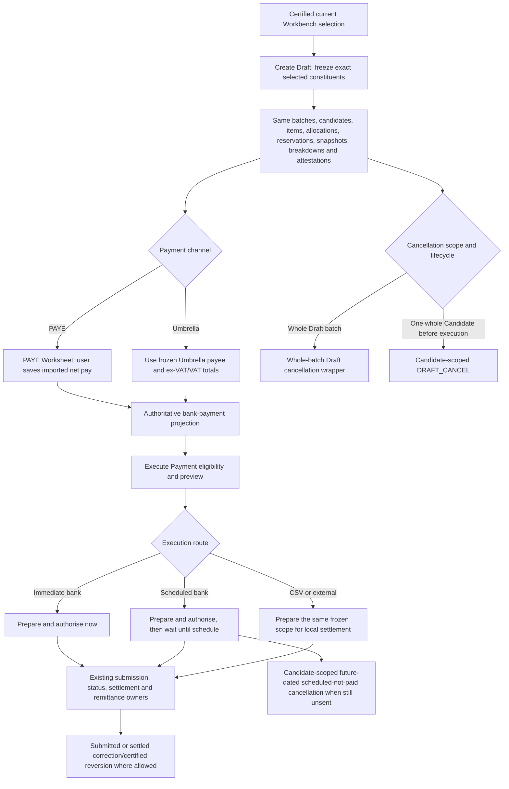

# Banking Pay: Create Draft to Execute Payment lifecycle map

This is a chronological navigation map derived from `BANKING_PAY_CREATE_DRAFT_EXECUTE_POLICY_CONTRACT_V1.json`. The canonical JSON contract remains the sole policy authority. This file does not create another financial oracle, change policy, or authorise a real Draft or payment. Repository folders still named `supabase` are historical source-path names; Miget TEST is the database runtime authority.

## The zero-drift promise

A revised Create Draft route may change only how bounded work is transported, paged, resumed and reported. It must finish with the same frozen business rows and the same operation result. Every later Banking Pay owner must receive the same input and must make the same decision without knowing which Draft route created it.

## Chronological contract

### 1. Workbench hands over one exact selected universe

- Input authority: the settled Workbench certificate, once populated and installed, supplies the complete ordered constituent and partition identity, not browser-loaded rows.
- The hand-off binds session/version/generation, exact selected count, stable constituent digest, partition digest and accepted source/install/deployment identities.
- A stale, incomplete, duplicated, missing or mismatched selection fails before any Draft finance work. Unloaded pages and Candidate independence must not hide selected Timesheets.
- Before freezing, the current Workbench is authoritative. After freezing, the Workbench cannot silently rewrite or poison the Draft.

### 2. Create Draft freezes the accepted policy outcome

The current phase order and decision owners are:

1. **VALIDATE_SESSION** — Re-read the current Workbench selection/readiness/context and preserve override rules; create no finance output. Owner: `pay_workbench_prepare_draft`.
2. **SYNC_SELECTED_ROWS** — Persist the accepted validation receipt and advance only the same certified selected-row operation; do not reconstruct selection. Owner: `Worker operation state`.
3. **WAIT_FOR_PREVIEW_READY** — Require the same current Workbench session to remain Ready before any Draft scope is frozen. Owner: `pay_workbench_session_get_progress`.
4. **SEED_CANDIDATE_SCOPE** — Freeze the complete selected constituent identities by candidate and channel; exact count/digest/missing/extra checks. Owner: `pay_workbench_prepare_draft_scope_seed`.
5. **DRAIN_TSFIN** — Complete required Timesheet financial readiness for the frozen scope; no timeout relaxation or skip. Owner: `Worker + existing TSFIN readiness owners`.
6. **ENSURE_PAYEE_READINESS** — Validate existing payee/bank readiness for the frozen scope without changing payee/channel policy. Owner: `Worker + existing payee readiness owner`.
7. **SEED_ALLOCATION_ROWS** — Create source-owned allocation facts; preserve recovery/headroom ordering. Owner: `pay_workbench_prepare_draft_allocation_rows_seed`.
8. **CREATE_BATCH_SHELLS** — Create the same PAYE/Umbrella batch shells and statuses. Owner: `pay_batch_shell_ensure_from_operation`.
9. **INSERT_CANDIDATES** — Create exact batch-candidate membership once. Owner: `pay_batch_insert_candidates_from_preview`.
10. **INSERT_ITEMS** — Materialise ordinary items or certify the exact finance handoff; calculate no finance economics. Owner: `pay_batch_insert_items_from_preview`.
11. **APPLY_FINANCE_ADJUSTMENTS** — Existing owner materialises finance items, allocations, PAYE/Umbrella treatment and case state. Owner: `pay_batch_apply_finance_adjustments`.
12. **FINALISE_RESERVATIONS** — Create exact reservations, retention markers, signed recovery evidence and final authority. Owner: `pay_batch_finalize_reservations_and_markers`.
13. **POPULATE_CANDIDATE_SUMMARIES** — Freeze candidate and batch totals derived from items. Owner: `pay_batch_populate_candidate_summaries`.
14. **CREATE_TIMESHEET_SNAPSHOTS** — Freeze the same source Timesheet snapshots and lineage. Owner: `pay_batch_create_timesheet_snapshots`.
15. **BUILD_ITEM_BREAKDOWNS** — Freeze the same item breakdowns and component evidence. Owner: `pay_batch_build_item_breakdowns`.
16. **ASSERT_INTEGRITY** — Reject incomplete/duplicate/inconsistent Draft artifacts; no hiding rows. Owner: `pay_batch_assert_integrity`.
17. **POST_CREATE_REFRESH** — Return the same created batch IDs/result fields and refresh source visibility. Owner: `Worker operation result + Workbench targeted refresh`.

The revised route must leave all of these durable outputs equivalent to the accepted route:

- **pay_batches:** Compare full typed V1 and candidate rows after role-mapping only generated technical IDs; no money/status/type/key/hash normalization.
- **pay_batch_candidates:** Compare full typed V1 and candidate rows after role-mapping only generated technical IDs; no money/status/type/key/hash normalization.
- **pay_batch_items:** Compare full typed V1 and candidate rows after role-mapping only generated technical IDs; no money/status/type/key/hash normalization.
- **banking_pay_operation_candidate_allocation_rows:** Compare full typed V1 and candidate rows after role-mapping only generated technical IDs; no money/status/type/key/hash normalization.
- **pay_advance_reservations and timesheet_financial_retention:** Compare full typed V1 and candidate rows after role-mapping only generated technical IDs; no money/status/type/key/hash normalization.
- **timesheet snapshots:** Compare full typed V1 and candidate rows after role-mapping only generated technical IDs; no money/status/type/key/hash normalization.
- **item breakdowns:** Compare full typed V1 and candidate rows after role-mapping only generated technical IDs; no money/status/type/key/hash normalization.
- **finance effects:** Compare full typed V1 and candidate rows after role-mapping only generated technical IDs; no money/status/type/key/hash normalization.
- **expected-effect attestations:** Compare full typed V1 and candidate rows after role-mapping only generated technical IDs; no money/status/type/key/hash normalization.
- **post-Draft authority and fast-reversion lineage:** Compare full typed V1 and candidate rows after role-mapping only generated technical IDs; no money/status/type/key/hash normalization.
- **operation result/audit:** Compare full typed V1 and candidate rows after role-mapping only generated technical IDs; no money/status/type/key/hash normalization.

### 3. Draft completion is the boundary from live to frozen authority

- The completed Draft contains the same PAYE/Umbrella batch split, Candidate membership, stable source/economic keys, amounts, VAT, reservations, Timesheet snapshots, item breakdowns, finance effects, expected-effect attestations, provenance and fast-reversion lineage.
- Overview, Current Payment Status and every execution projection read those frozen artifacts. They do not recalculate the original Workbench economics.
- Operation response fields, created batch IDs, status, phase, error and terminal interpretation remain backward-compatible. New diagnostics may be additive only.

### 4. PAYE Worksheet is an intentional intermediate step

- Owner: `public.pay_set_paye_net_manual`. It applies only to PAYE batches and rejects Loans batches.
- The user imports or enters each PAYE Candidate net amount before execution. The owner validates exact frozen Candidate membership, mutability and freshness before saving it.
- `GROSS_ADD` and `GROSS_DEDUCT` belong inside the payroll net calculation. `NET_ADD` and `NET_DEDUCT` are applied after the imported payroll net. These four labels are not interchangeable.
- PAYE net cannot be changed once the payment has crossed into scheduled, submitted, committed, executed, paid, settled or cancelled lifecycle states.
- The saved net value and its state hash become part of the authoritative bank-payment projection. A missing required PAYE net blocks execution; Create Draft must never invent it.

### 5. Umbrella preparation stays separate

- Umbrella does not use the PAYE manual-net owner. Its frozen owner retains the exact Umbrella payee, payment channel, ex-VAT amount, VAT amount, inclusive amount, bank-details evidence and week/payment grouping.
- PAYE tax labels must not leak into Umbrella calculations. Conversely, Umbrella VAT or payee routing must not be inferred for PAYE.
- Mixed Drafts remain separate PAYE and Umbrella partitions even when they came from one Create Draft operation.

### 6. The bank-payment projection is the Execute Payment scalar authority

- Owner: `public._pay_batch_bank_payment_projection_rows`.
- PAYE beneficiary amounts come from the frozen Draft plus the valid saved PAYE net state. Umbrella beneficiary amounts and payee identity come from the frozen Umbrella evidence.
- Positive and explicit-zero groups, projection row counts and hashes remain exact. No Worker or frontend code may repair an amount, beneficiary or channel.

### 7. Execute Payment validates the frozen result

- `public.pay_batch_execution_summary_get` and `public.pay_batch_payment_status_page_v1` expose the current eligibility, blockers, rows, amounts, statuses and allowed actions.
- The execution handler accepts the established scopes `ALL`, `PAYE`, `UMBRELLA` and `LOANS`; routes `STANDARD_BANK`, `CSV_SETTLEMENT` and `EXTERNAL_SETTLEMENT`; and schedule kinds `IMMEDIATE` and `SCHEDULED`.
- Freshness, integrity, reauthorisation, bank/rail availability, blocked-funds retry rules, CSV currency and remittance-suppression confirmation remain unchanged.
- The revised Draft route/version is not an execution input. There must be no route-specific branch; if Execute Payment requires one, parity has failed.

### 8. Transfer scope and preparation remain row-backed and authoritative

- `public.pay_execute_bank_transfer_scope_seed` selects the exact frozen Candidate/channel/payment groups and fails if required PAYE net is absent.
- `public.pay_execute_bank_transfer_chunk_prepare` creates or reuses the exact transfer preparation evidence, including void overlays and projection hashes, without changing the beneficiary or amount.
- Bounded pages and resumable receipts are permitted. Giant repeated arrays, hidden truncation, relaxed timeouts and partial frozen scope are prohibited.

### 9. Immediate and scheduled bank payments make the same financial decision

- Both routes call the unchanged preparation and authorisation owners with the same frozen projection, scope, payment date, funding account, warnings and remittance decision.
- `IMMEDIATE` can continue to provider submission after authorisation. `SCHEDULED` records the same authorised intent and waits until the scheduled time. The difference is timing, not Candidate membership, beneficiary, amount, VAT, item or policy.
- A stale previous authorisation request may be safely cancelled and replayed once under the same operation idempotency boundary; it must not create a second payment intent.

### 10. CSV and external settlement use the same frozen projection

- CSV export reads the exact bank projection and state hashes. CSV/local settlement cannot continue to a provider-submission phase.
- External settlement requires its existing evidence/comment contract. Neither route may silently change the amount or claim a provider submission.
- Verification may prove preparation, validation and safe routing, but it must not perform a real settlement.

### 11. Submission, status, settlement and remittance remain unchanged

- Provider preparation and claim consume only the existing prepared transfer scope and idempotency evidence. Tests stop before any real provider call.
- Current Payment Status continues to show the same per-payment rows, amounts, statuses, actions, correction evidence and retry/blocked-funds state.
- Settlement consumes the same submitted/settled transfer evidence. Remittance generation or suppression consumes the same frozen items, breakdowns, payee and execution state. Tests must not send a remittance.

### 12. Cancellation before provider payment preserves the same outcome

- Whole-batch and whole-Candidate cancellation are different contracts. `public.pay_batch_cancel` is the whole-batch Draft wrapper only; it must never be used as a shortcut for a Candidate selection.
- For one whole Candidate, the Worker freezes the reviewed `CANDIDATES` scope through `pay_payment_correction_request_start`. `_pay_payment_correction_selected_items` and `pay_payment_correction_selection_prepare_chunk_v1` bind that Candidate membership to its exact active items, allocation/reservation and transfer evidence before mutation.
- An untouched post-Draft/pre-execution Candidate follows the existing `DRAFT_CANCEL` overlay path. The Candidate-scoped overlay owner voids/releases the selected Candidate artifacts and republishes its Workbench source from frozen lineage. Every unrelated Candidate row, item, allocation, reservation, payment readiness and eventual bank projection must remain unchanged.
- A Candidate whose future-dated payment has been authorised/scheduled but remains local and not sent is classified as `SCHEDULED_LOCAL_NOT_SENT` (or `LOCAL_PREPARED_NOT_SENT`) and follows `PRE_PROVIDER_CANCEL_AND_RECALCULATE`. `pay_payment_correction_process_chunk` invokes the bounded Candidate page and `pay_pre_bank_cancel_apply_work_item`; settled/provider-submitted evidence blocks this route.
- Candidate cancellation must be whole-Candidate: no missing active item, finance case/component, reservation or transfer is allowed. Exact reservations/items are voided or released, summaries are recalculated, and Workbench source reappears exactly once. No live economic reconstruction or effect on another Candidate is allowed.

### 13. Executed-not-paid correction and certified reversion use frozen lineage

- “Executed” does not by itself mean money was paid. A future-dated scheduled/local payment that is still unsent uses the Candidate-scoped pre-provider route above. Once provider submission, completion or settlement evidence exists, that route must reject rather than pretending it is still local.
- `public.pay_payment_correction_request_start` owns correction admission and rejects terminal or unsafe requests.
- `public.pay_settled_payment_reversal_apply_work_item` applies a certified safe reversion only from the frozen source/effect/settlement lineage.
- Where safe reversion is not established, the existing correction, retry, blocked-funds or manual-resolution fallback remains authoritative. A revised Draft route cannot weaken that decision.

## Channel and route comparison

| Point | PAYE | Umbrella | Must remain identical between Draft routes |
|---|---|---|---|
| Draft grouping | PAYE batch/Candidate membership | Umbrella channel/payee grouping | Exact batches and membership |
| Before execution | User-saved PAYE net required where applicable | No PAYE-net entry; frozen ex-VAT/VAT/payee evidence | Same readiness/blockers |
| Bank amount | Frozen Draft plus saved PAYE net; gross/net labels remain distinct | Frozen Umbrella inclusive payment evidence | Every penny and projection hash |
| Beneficiary | Candidate destination | Frozen Umbrella payee destination | Same identity and bank-details hash |
| Immediate versus scheduled | Same amount and scope; timing differs | Same amount and scope; timing differs | Same authorised intent |
| Whole-Candidate cancellation/reversion | Frozen Candidate/item/allocation/reservation/effect lineage | Frozen Candidate/Umbrella/item/allocation/reservation/effect lineage | Same selected Candidate release/void/reappearance; every unrelated Candidate unchanged |

## Downstream owner evidence

| Boundary | Existing owner | Decision that must not change | Source |
|---|---|---|---|
| Batch Overview and execution eligibility | `public.pay_batch_execution_summary_get` | Produces the authoritative high-level batch, candidate, bank-out and readiness summary consumed before execution. | supabase/repeatable/26052026_2100HRS_NEW_FUNCTIONS.sql: current pay_batch_execution_summary_get definition |
| Current Payment Status | `public.pay_batch_payment_status_page_v1` | Returns stable paged payment rows, statuses and exact allowed actions; the frontend must not repair or infer them. | supabase/repeatable/04082026_1146_pay_batch_payment_status_page_v1.sql |
| PAYE Worksheet save and bank scalar | `public.pay_set_paye_net_manual` | Validates and saves imported PAYE net amounts; gross items are already reflected while net items adjust afterward. | supabase/repeatable/21072026_1235_48_pay_set_paye_net_manual.sql |
| Frozen bank payment projection | `public._pay_batch_bank_payment_projection_rows` | Produces the final per-beneficiary bank amount and projection hash used by Execute and CSV. | supabase/repeatable/20072026_1105_resolve_paye_deduction_bank_projection.sql |
| Bank CSV evidence | `public.pay_bank_csv_export_summary_get plus frozen bank projection` | Exports only the exact positive/explicit-zero frozen payment scope and rejects projection or row-count change. | supabase/repeatable/26052026_2100HRS_NEW_FUNCTIONS.sql: pay_bank_csv_export_summary_get |
| Execute Payment scope | `public.pay_execute_bank_transfer_scope_seed` | Seeds the exact transfer work scope; no Create Draft version is an input. | supabase/repeatable/20072026_1215_align_transfer_scope_with_bank_projection.sql |
| Bank-transfer preparation | `public.pay_execute_bank_transfer_chunk_prepare` | Creates/reuses exact transfer preparation evidence without changing beneficiary or amount. | supabase/repeatable/12082026_1446_pay_execute_bank_transfer_chunk_prepare_voided_overlay.sql |
| Provider submission claim | `public.pay_bank_transfers_claim_provider_submit_chunk` | Claims only safe prepared transfers for unchanged provider submission. | supabase/repeatable/04082026_1154_pay_bank_transfers_claim_provider_submit_chunk.sql |
| Settlement | `public.pay_settle_rail` | Applies authoritative settlement results within existing 6000ms/1000ms budgets. | supabase/repeatable/04082026_1211_pay_settle_rail.sql |
| Remittance scope and rendering | `public.pay_operation_remittance_scope_seed + public.pay_remittance_build + public.pay_remittance_maybe_queue_for_trigger` | Generates or suppresses the same candidate/Umbrella remittance from frozen Draft and execution evidence. | supabase/repeatable/26052026_2100HRS_NEW_FUNCTIONS.sql: remittance owners |
| Whole-batch Draft cancellation wrapper | `public.pay_batch_cancel` | Cancels only the explicitly requested whole Draft batch. It is not the owner for a whole-Candidate selection and cannot be used to widen Candidate scope. | supabase/repeatable/04082026_1206_pay_batch_cancel.sql |
| Whole-Candidate cancellation before payment | `pay_payment_cancelability_diagnostic → correction request/selection → Candidate-scoped Draft overlay or pre-bank cancellation page` | Freezes the selected Candidate membership, then voids/releases only that Candidate whole-payment scope. Untouched Draft and future-dated scheduled/local-not-sent states take their established separate branches; unrelated Candidates must remain unchanged and payable. | supabase/repeatable/09082026_1403_pay_payment_correction_selected_items_draft_scope.sql; supabase/repeatable/04082026_1147_pay_payment_correction_selection_prepare_chunk_v1.sql; supabase/repeatable/04082026_1207_pay_payment_correction_request_start.sql; supabase/repeatable/04082026_1208_pay_payment_correction_expand_work.sql; supabase/repeatable/04082026_1209_pay_payment_correction_process_chunk.sql; supabase/repeatable/04082026_1158_pay_pre_bank_cancel_apply_work_item.sql; supabase/repeatable/09082026_0712_banking_pay_semantic_ready_helpers.sql |
| Executed/settled correction and certified reversion | `public.pay_payment_correction_request_start + public.pay_settled_payment_reversal_apply_work_item` | Uses certified frozen lineage to reverse/correct or chooses the established safe fallback; never live-reconstructs the Draft. | supabase/repeatable/04082026_1207_pay_payment_correction_request_start.sql plus current monolith settled reversal |
| Frontend interpretation | `TEST-Frontend/js/main.js current Banking Pay child/modal code` | Renders current authoritative fields and backend-resolved actions; no route-version repair is permitted. | TEST-Frontend/js/main.js at frontend commit e58e567f66ed8108a40e3c3e8388dbe33e0b0361 |

## Exact parity gate before enablement

For two equivalent fresh fixture universes, compare the accepted Draft route with the revised route in stable business order. Generated technical IDs may be role-mapped only where the fixture expressly permits it. Compare everything else as typed data:

- operation response, terminal phase and created batch IDs by stable role;
- channel groups and complete Candidate/Timesheet/paired-Timesheet constituent membership;
- item source/economic keys, allocation identities and every pence amount;
- PAYE gross/net classifications, saved PAYE net values and state hashes;
- Umbrella ex-VAT, VAT, inclusive totals, payee and bank-details evidence;
- reservations, retention markers, Timesheet snapshots and item breakdowns;
- finance effects, expected-effect attestations, post-Draft authority and fast-reversion lineage;
- Overview, Current Payment Status, PAYE Worksheet, Execute Payment eligibility/preview and bank projection outputs;
- immediate and scheduled authorisation preparation, CSV/external preparation, whole-batch cancellation, whole-Candidate pre-execution cancellation, whole-Candidate future-dated scheduled-not-paid cancellation and certified-reversion eligibility;
- replay, response loss, concurrency and failure rollback with no partial Draft or external payment effect.

The executable matrix must cover all finite classes in the canonical contract, including paired Timesheets and all supported cross-class combinations. Totals are secondary evidence: one missing or misclassified constituent fails parity even when totals happen to match.

## Hard stop conditions

- Any changed payment eligibility, amount, tax, VAT, payment method, beneficiary, grouping, approval, hold, exception or final outcome.
- Any missing, extra, duplicated, truncated or re-ordered constituent outside the declared stable order.
- Any downstream compatibility branch for the revised Draft route.
- Any increased/disabled statement or lock timeout, giant pre-chunk array, unbounded scan or partial frozen state.
- Any real provider, payment, settlement or remittance action during parity testing.
- Any unexplained difference, open acceptance TODO, skipped supported case, surviving mutation or Banking Pay Bible contradiction.

## Current proof status

- **Policy mapping:** complete in the adjacent canonical JSON and its 88 finite classes.
- **This lifecycle relationship map:** generated from the same source-bound owner census; it adds no policy.
- **Implementation parity:** remains a separate executable gate. Mapping an owner is not proof that the revised route has produced byte-for-byte equivalent downstream inputs.
- **Miget installation and final acceptance:** require the approved coherent release, exact installed identities and one fresh post-install audit.
