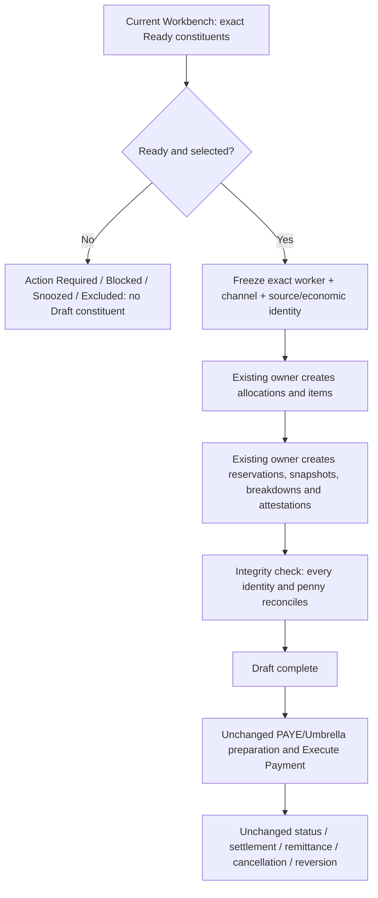
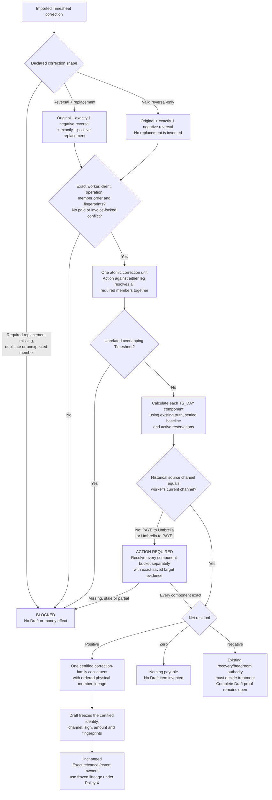

# How Banking Pay must treat every payment

This is the human-readable projection of `BANKING_PAY_CREATE_DRAFT_EXECUTE_POLICY_CONTRACT_V1`. It explains the current policy outcomes that any faster or revised Create Draft route must reproduce. It does **not** authorise a policy change or a payment action.

## The one rule that governs everything

Before Draft, CloudTMS uses the current Workbench and its existing financial owners. Create Draft freezes those exact decisions. After Draft, Execute Payment, status, settlement, cancellation and reversion use only the frozen Draft evidence. A new route may transport the work differently; it may not make a different decision.
The HANDOVER 1 certificate is currently a source-level contract only, not a populated or installed certificate. It defines what a future Draft route must consume; it is not permission to infer or rebuild selection in the Worker.

## Gross and net: why the four PAYE labels are not interchangeable

- **PAYE_GROSS_ADD:** Taxable value belongs inside payroll gross. The saved PAYE net already reflects it, so the bank amount must not add it again. Bank amount owner: saved PAYE net
- **PAYE_GROSS_DEDUCT:** Taxable deduction belongs inside payroll gross. The saved PAYE net already reflects it, so the bank amount must not deduct it again. Bank amount owner: saved PAYE net
- **PAYE_NET_ADD:** Fixed or non-taxable credit is added after the imported payroll net. Bank amount owner: saved PAYE net plus certified NET_ADD items
- **PAYE_NET_DEDUCT:** Fixed or non-taxable deduction is taken after the imported payroll net. Bank amount owner: saved PAYE net less certified NET_DEDUCT items
- **UMBRELLA_NONE:** PAYE gross/net treatment does not apply. Existing Umbrella ex-VAT, VAT, inclusive amount, payee and channel owners remain authoritative. Bank amount owner: frozen Umbrella payment projection

Two name changes are deliberate and must not be mistaken for duplicate products: visible **PAYMENT_ADVANCE_REPAYMENT** freezes as **LOAN_REPAYMENT**, and visible **MANUAL_CREDIT_ADJUSTMENT_PAYMENT** freezes as **MANUAL_CREDIT_PAYOUT**. The visible name describes the Workbench decision; the frozen name is the existing Draft/settlement vocabulary.

## Payment-by-payment operating model

| Payment family | What it means | Ready/selection rule | PAYE | Umbrella | Frozen Draft result |
|---|---|---|---|---|---|
| Ordinary Timesheet hours and rate components | A processed, authorised Timesheet has an unpaid current entitlement. | Only Ready components are selectable. Action Required, Blocked, snoozed, ineligible, superseded and already-active-Draft components are excluded. | GROSS_ADD for ordinary positive earnings | existing frozen Umbrella ex-VAT/VAT/inclusive owners | One or more frozen SEGMENT_DELTA items retain the exact component/economic identities; totals are a consequence, not the identity. |
| Paired Timesheets: reversal plus replacement | An import-authoritative changed-hours correction replaces an earlier Timesheet by creating one reversal leg and one replacement leg under one correction operation. | The correction unit is valid only when it has exactly one reversal and one replacement with the expected envelope, count, roles and fingerprints. Authorise/unauthorise/process/unprocess transitions are atomic across both legs. | TAXABLE_CHANNEL_SENSITIVE; target resolution required if source channel differs | target ex-VAT/VAT amount requires existing channel authority; never converted by guess | The pair is not collapsed into one invented payment. Frozen constituents preserve the ordered pair lineage and component identity, while the latest positive leg may act as the carrier Timesheet. |
| Paired Timesheet lifecycle: reversal-only cancellation correction | An import-authoritative cancellation removes previously accepted hours without a positive replacement leg. | Expected member count is one, reversal count is one and replacement count is zero. The same atomic lifecycle and stale/paid/invoiced guards apply. | existing signed recovery and PAYE owners only | existing frozen Umbrella authority only | Only the actual residual is frozen. A reversal row is not automatically converted into a payment or recovery merely because it is negative. |
| Timesheet expenses, travel, accommodation, other and mileage | An authorised Timesheet contains an unpaid expense component. | Each Ready expense component is selected independently. A blocked/snoozed expense does not disappear an unrelated Ready hours or expense component. | GROSS_ADD in the current canonical component projection | preserve component ex-VAT and existing Umbrella VAT snapshot/rate | MILEAGE maps to MILEAGE_DELTA; the other expense codes map to EXPENSE_DELTA. Source keys and expense code remain distinct. |
| Additional-code and adjustment-code Timesheet components | A Timesheet has a separately identified additional or adjustment component. | Each component is independent even when another component shares a date or total. | existing component treatment; no reclassification by label | existing component VAT authority | Stable key and source identity survive; a label collision must not turn a component into a finance case. |
| Forced Timesheet “advance this payment” | An authorised override permits a particular otherwise-timed Timesheet payment into this pay run. | The override changes timing eligibility only; it does not change the money, channel, rate, tax or component identity. | unchanged ordinary PAYE treatment | unchanged Umbrella authority | Ordinary frozen artifacts plus the existing override evidence; no loan or finance-case item is invented. |
| Already-paid, part-paid, reserved and superseded source treatment | Some or all of a source component has already been paid, reserved or superseded. | Fully settled or superseded authority is absent from Ready. A part-paid component contributes only its exact remaining amount. Cancelling an untouched Draft may release it to appear once again. | unchanged from original family | unchanged from original family | No duplicate full payment; the exact residual and lineage are frozen. |
| Payment advance / loan payout | The agency pays the worker an advance before it becomes a repayment schedule. | Ready only when Lifecycle is not PAID. It remains blocked when snoozed, unresolved, invalid, zero due or otherwise case-blocked. | NET_ADD | existing Umbrella ex-VAT/VAT/inclusive amount, payee and channel rules | Visible LOAN_PAYOUT becomes frozen LOAN_PAYOUT; allocation linkage and finance-case/component lineage remain exact. |
| Payment advance repayment | The worker repays a previously paid advance. LOAN_REPAYMENT is the hidden/frozen item vocabulary, not a second visible product. | Ready only when Lifecycle is PAID and a repayment is due. It remains blocked when snoozed, unresolved, invalid, zero due or otherwise case-blocked. | NET_DEDUCT | existing Umbrella ex-VAT/VAT/inclusive amount, payee and channel rules | Visible PAYMENT_ADVANCE_REPAYMENT becomes frozen LOAN_REPAYMENT; allocation linkage and finance-case/component lineage remain exact. |
| Overpayment recovery | The worker owes back a previous overpayment, but no more than current policy permits in this run. | Ready only when A valid overpayment balance remains recoverable. It remains blocked when snoozed, unresolved, invalid, zero due or otherwise case-blocked. | TAXABLE → GROSS_DEDUCT; NON_TAXABLE → NET_DEDUCT | existing Umbrella ex-VAT/VAT/inclusive amount, payee and channel rules | Visible OVERPAYMENT_RECOVERY becomes frozen OVERPAYMENT_RECOVERY; allocation linkage and finance-case/component lineage remain exact. |
| Underpayment payment | The agency owes the worker an amount previously underpaid. | Ready only when A valid underpayment balance remains due. It remains blocked when snoozed, unresolved, invalid, zero due or otherwise case-blocked. | TAXABLE → GROSS_ADD; NON_TAXABLE → NET_ADD | existing Umbrella ex-VAT/VAT/inclusive amount, payee and channel rules | Visible UNDERPAYMENT_PAYMENT becomes frozen UNDERPAYMENT_PAYMENT; allocation linkage and finance-case/component lineage remain exact. |
| Manual credit adjustment payment | An authorised manual correction increases what the worker is paid. The visible and frozen names deliberately differ. | Ready only when An authorised manual credit remains payable. It remains blocked when snoozed, unresolved, invalid, zero due or otherwise case-blocked. | TAXABLE → GROSS_ADD; NON_TAXABLE → NET_ADD | existing Umbrella ex-VAT/VAT/inclusive amount, payee and channel rules | Visible MANUAL_CREDIT_ADJUSTMENT_PAYMENT becomes frozen MANUAL_CREDIT_PAYOUT; allocation linkage and finance-case/component lineage remain exact. |
| Manual debt adjustment recovery | An authorised manual correction reduces what the worker is paid. | Ready only when An authorised manual debt remains recoverable. It remains blocked when snoozed, unresolved, invalid, zero due or otherwise case-blocked. | TAXABLE → GROSS_DEDUCT; NON_TAXABLE → NET_DEDUCT | existing Umbrella ex-VAT/VAT/inclusive amount, payee and channel rules | Visible MANUAL_DEBT_RECOVERY becomes frozen MANUAL_DEBT_RECOVERY; allocation linkage and finance-case/component lineage remain exact. |
| Manual adjustment carry-forward after correction/reversion | A prior correction produces a certified amount that must be carried into a later Draft. | Only READY/current unconsumed carry-forward authority is draftable. | stored source treatment | stored source VAT treatment | The stored source economics and complete correction lineage are frozen without reinterpretation. |
| Signed recovery/return from frozen historical component evidence | A historical frozen document proves an exact signed non-charge movement for a component. | Cardinality applies only after full signed pre-signature filtering; ordinary same-key components do not count as signed evidence. | existing frozen evidence | existing frozen evidence | Exact decisive component shape/digest is carried into finalisation and reservation evidence. |

## Paired Timesheets — the special flow

The pair is atomic for lifecycle actions, but it is not one invented lump-sum payment. The reversal and replacement Timesheets, their policy fingerprints and their component identities remain visible to the authority. A genuine `REVERSAL_ONLY` correction is valid; a `REVERSAL_REPLACEMENT` correction that has lost its replacement is invalid and cannot be relabelled as reversal-only by Create Draft. PAYE/Umbrella changes are resolved jointly at correction-unit readiness, but each economic component must have its own exact saved target amount and fingerprints. Broken, duplicated, stale, cross-worker, cross-client, partially paid, partially invoiced, partially resolved and unrelated-overlap shapes fail closed.

The member-deletion outcomes are intentionally different:

- A canonical cancellation-created reversal-only unit is valid. Its exact negative residual becomes the existing overpayment-recovery obligation; without same-worker, same-channel positive headroom it remains retained outside the Draft.
- Deleting only the positive replacement while retaining the negative reversal is a valid user-confirmed business outcome. Current source does not yet implement that transition: standard delete targets both changed-hours members. The safe correction belongs upstream and must atomically republish the survivor as a genuine `REVERSAL_ONLY` unit.
- Deleting only the negative reversal is prohibited. A positive-only remnant has no reversal and fails closed.
- Deleting the complete correction pair is valid when existing financial-retention checks permit deletion; where durable history must remain, the existing archive outcome still governs.

Local PostgreSQL 17.11 and 18.6 evidence proves the exact canonical positive pair path, PAYE and Umbrella, cross-channel fail-closed-then-resolved behavior, atomic transition/replay, response-loss replay, broken/stale/mixed/paid/invoiced blocks, ordinary/unrelated overlap preservation, positive-only rejection, and the genuine reversal-only recovery/headroom outcome. Read-only Miget inspection confirms the installed chain, deletion and recovery owners have those same boundaries. The replacement-only deletion-to-reversal-only transition remains an explicit upstream implementation gap; Draft validation must not be weakened to conceal it.

The machine contract freezes **88 finite logical classes**. This is a bounded policy matrix—not a claim to enumerate infinite dates or money values.

## Create Draft stages whose decisions must not change

1. **VALIDATE_SESSION** — Re-read the current Workbench selection/readiness/context and preserve override rules; create no finance output. Owner: `pay_workbench_prepare_draft`.
1. **SYNC_SELECTED_ROWS** — Persist the accepted validation receipt and advance only the same certified selected-row operation; do not reconstruct selection. Owner: `Worker operation state`.
1. **WAIT_FOR_PREVIEW_READY** — Require the same current Workbench session to remain Ready before any Draft scope is frozen. Owner: `pay_workbench_session_get_progress`.
1. **SEED_CANDIDATE_SCOPE** — Freeze the complete selected constituent identities by candidate and channel; exact count/digest/missing/extra checks. Owner: `pay_workbench_prepare_draft_scope_seed`.
1. **DRAIN_TSFIN** — Complete required Timesheet financial readiness for the frozen scope; no timeout relaxation or skip. Owner: `Worker + existing TSFIN readiness owners`.
1. **ENSURE_PAYEE_READINESS** — Validate existing payee/bank readiness for the frozen scope without changing payee/channel policy. Owner: `Worker + existing payee readiness owner`.
1. **SEED_ALLOCATION_ROWS** — Create source-owned allocation facts; preserve recovery/headroom ordering. Owner: `pay_workbench_prepare_draft_allocation_rows_seed`.
1. **CREATE_BATCH_SHELLS** — Create the same PAYE/Umbrella batch shells and statuses. Owner: `pay_batch_shell_ensure_from_operation`.
1. **INSERT_CANDIDATES** — Create exact batch-candidate membership once. Owner: `pay_batch_insert_candidates_from_preview`.
1. **INSERT_ITEMS** — Materialise ordinary items or certify the exact finance handoff; calculate no finance economics. Owner: `pay_batch_insert_items_from_preview`.
1. **APPLY_FINANCE_ADJUSTMENTS** — Existing owner materialises finance items, allocations, PAYE/Umbrella treatment and case state. Owner: `pay_batch_apply_finance_adjustments`.
1. **FINALISE_RESERVATIONS** — Create exact reservations, retention markers, signed recovery evidence and final authority. Owner: `pay_batch_finalize_reservations_and_markers`.
1. **POPULATE_CANDIDATE_SUMMARIES** — Freeze candidate and batch totals derived from items. Owner: `pay_batch_populate_candidate_summaries`.
1. **CREATE_TIMESHEET_SNAPSHOTS** — Freeze the same source Timesheet snapshots and lineage. Owner: `pay_batch_create_timesheet_snapshots`.
1. **BUILD_ITEM_BREAKDOWNS** — Freeze the same item breakdowns and component evidence. Owner: `pay_batch_build_item_breakdowns`.
1. **ASSERT_INTEGRITY** — Reject incomplete/duplicate/inconsistent Draft artifacts; no hiding rows. Owner: `pay_batch_assert_integrity`.
1. **POST_CREATE_REFRESH** — Return the same created batch IDs/result fields and refresh source visibility. Owner: `Worker operation result + Workbench targeted refresh`.

## What Execute Payment must see

- **Current Payment Status:** same rows; same payment lifecycle/status/action; same amounts and evidence.
- **PAYE Worksheet:** same PAYE candidates/items; same gross additions/deductions; same net additions/deductions; same saved net scalar and state hash.
- **Umbrella payment/remittance:** same payee/channel; same ex-VAT/VAT/inclusive totals; same remittance visibility/suppression.
- **Overview:** same beneficiary counts; same channel/payment totals; same actions/statuses.
- **Execute Payment eligibility/preview:** same freshness and integrity result; same batch/candidate/item/allocation scope; same bank projection and hashes.
- **Immediate/scheduled provider submission:** same frozen projection; same provider/rail environment authority; same idempotency/effect attestations.
- **Bank transfer and CSV settlement:** same payment rows/references/amounts; same positive/explicit-zero classification; same projection hash.
- **External settlement/remittance:** same execution/settlement lineage; same remittance generation or suppression.
- **Cancellation before payment:** same whole-batch versus whole-Candidate scope; same cancelability decision; same selected releases/voids with unrelated Candidates unchanged; same Workbench reappearance exactly once.
- **Executed-not-paid cancellation and certified reversion:** same whole-Candidate scope for local or future-dated scheduled payments not sent to the provider; same frozen lineage; same safe reversion or established fallback; same blocked-funds/correction behavior.
- **Frontend operation polling:** same operation type/status/phase/result/error fields; same terminal interpretation; no V2-specific branch.

No downstream screen, payment owner, settlement route or cancellation/reversion owner may contain a special branch for the revised Draft route. If it needs one, the new route has failed parity.

The machine contract separately binds the installed owner and source evidence for all thirteen downstream boundaries: summary/eligibility, Current Payment Status, PAYE net, bank projection, CSV, execution scope, transfer preparation, provider claim, settlement, remittance, pre-provider cancellation, settled correction/reversion and frontend interpretation.

## How zero drift is proved

Two equivalent fresh fixture universes are created. The accepted route builds one Draft and the candidate route builds the other. Generated technical IDs are matched by stable business role; every other typed field, identity, status, amount, VAT value and hash is compared exactly. The same downstream projections and lifecycle are then exercised. Totals are checked, but totals can never substitute for constituent-by-constituent equality.

## Known execution faults are not new policy

- **Original Workbench recovery failure:** source-package complete; not a populated installed certificate in this contract. Policy changed: no.
- **F-010 complete selected-set handoff and >100 scope incompatibility:** proved; final compact server-backed interface and runtime implementation remain gated. Policy changed: no.
- **F-013 six visible finance families rejected at current scope/INSERT_ITEMS handoff:** proved with 20 variants; provisional local owner proof only, not installed. Policy changed: no.
- **F-013b LOAN_REPAYMENT equality hypothesis:** NOT A DEFECT; deliberate visible PAYMENT_ADVANCE_REPAYMENT → frozen LOAN_REPAYMENT vocabulary. Policy changed: no.
- **Paired Timesheet replacement-only deletion transition:** USER-CONFIRMED POLICY; current standard delete targets both changed-hours members and has no explicit replacement-only delete plus REVERSAL_ONLY republish transition; not a Create Draft validation change. Policy changed: no.
- **Small Draft 99% latency:** measured as round-trip/orchestration dominant; must be improved without merging or skipping business owners. Policy changed: no.
