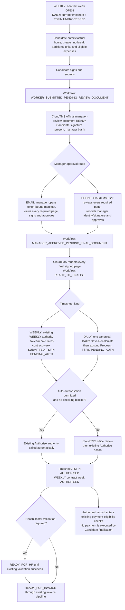
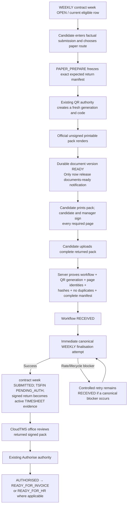
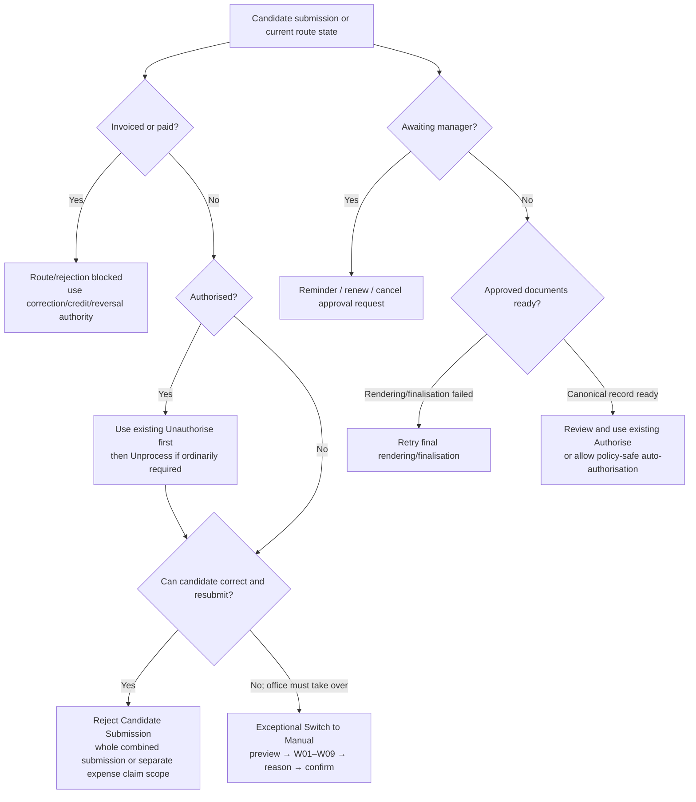

# CloudTMS Candidate App — Living Implementation Plan

Status: active implementation; TEST-only. Updated: 11 August 2026. The DB/RPC authority is installed. The separate public Candidate broker and private CloudTMS Candidate API are implemented and deployed to TEST with every Candidate feature flag false. This revision closes the Candidate timesheet-detail action authority: rejected history remains immutable and resubmission creates a new server-derived workflow; every independent rejection retains its own executable recovery action; detail is restricted to the exact card/version family; PAPER download and signed-return upload are enabled only after one exact immutable pack receipt is ready; and every action carries a typed server-owned invocation contract. Independent re-audit remains the API-freeze and frontend-code gate. The complete office-frontend implementation plan is nevertheless required now and must not be withheld merely because a backend audit verdict remains NO-GO.

This is the controlling, evolving delivery plan. It deliberately keeps the completed DB/RPC authority, the current private-backend/public-broker implementation, and the remaining CloudTMS frontend and Candidate App/web work in one sequence. It must be updated whenever implementation or independent audit changes the contract.

## Controlling architecture

- CloudTMS remains the sole owner of timesheet, financial and lifecycle truth.
- Candidate iOS/Android/web and manager browsers call a separate public Candidate broker. The broker calls a service-authenticated private CloudTMS Candidate API. Only that private API can compose DB/RPC, R2 and mail authority.
- The Candidate App and public broker submit factual candidate inputs only.
- DAILY office, worker and Candidate entry points use the one canonical DAILY financial owner, followed by the existing Process and Authorise authorities.
- WEEKLY Candidate finalisation uses the existing WEEKLY calculation/lifecycle authority.
- Route conversion uses the one SQL route/version authority and server-owned preview/confirmation context.
- Candidate workflows may orchestrate evidence, approval and notifications, but may not calculate rates, pay, charge, VAT, ERNI, margin, invoice breakdown or TSFIN.
- The existing invoice Generator/Issuer, official timesheet renderer and Google DAILY rota/availability service remain authoritative and unchanged in economic meaning.
- Banking Pay, Policy X, payment, settlement and remittance are out of scope and must not change.

## Stage 1 — DB/RPC authority (installed in TEST; keep under regression)

The installed authority consists of exactly seven Candidate App tables and fourteen public service-role Candidate business RPCs, plus the approved amended existing/private functions. Latest-only SQL lives in `supabase/migrations` and `supabase/repeatable`; no duplicate qualified function definitions are permitted.

Completed authority includes:

- clean Candidate account/challenge/session state with refresh-family rotation and replay revocation;
- candidate-safe bootstrap, list, detail and missing-week projections;
- canonical route family and import-authoritative view-only enforcement;
- evidence category, economics-driven evidence requirements and immutable lineage;
- one-expense-claim-until-authorised concurrency control;
- manager-review generation, immutable component manifest, page review, approval and final document lineage;
- complete workflow/QR-bound paper return manifest;
- stale-safe DAILY save/recalculate composition through the one financial authority;
- server-owned issue and auto-authorisation blocker derivation;
- route preview/confirmation context, W01–W14 warning codes, intervention reasons, workflow/request retirement, fresh resubmission notification and QR state separation;
- exact feature-off legacy route/restore wrappers and ACL compatibility;
- W13 proof against the immutable manager-approved required-component manifest.
- version-aware rejected-workflow projection through the replacement current contract-week row, with distinct hours/combined/expense recovery actions, monotonic same-family replacement precedence through `FINALISED`/`REFUSED`, and a plural scoped-rejection contract;
- current-version resolution for immutable workflow anchors and expense-carrier parents, preserving a finalised separate expense overlay when hours rotate from a historical ID to the replacement current version;
- one PAPER retirement seam for both active and finalised workflows, deriving the preceding immutable delivery generation after finalisation, fencing mail leases before rejection mutation, and proving QR ownership from the exact delivery mail context/hash independently of the rejected economic target.
- one exact rejected-claim replacement predicate shared by list and detail: combined claims require a later combined workflow on the same contract-week record, hours claims require later hours/combined on that same record, expense claims require a later expense/combined workflow for the same contract/week, and DAILY requires the same work date and stable booking family;
- one source-set PAPER retirement plan that locks every relevant waiting/received/finalised PAPER workflow and bound outbox row for the source, fails before mutation on any active provider lease, invalidates the current token through its exact immutable owner once, retires every stale mail/notification generation including already-cleared-token cases, and preserves unrelated finalised expense workflow/economic history.
- the source-set PAPER contract now treats `AWAITING_PAPER_RETURN`, retryable `RECEIVED` and `FINALISED` as one closed lifecycle set. `RECEIVED` uses its current workflow generation, participates in every source-owner, mail, provider-lease, token and notification query, and cannot be rejected until its obsolete delivery authority is retired or proved already inert;
- linked hours-source and separate-expense rejection now acquire one candidate/contract/week family advisory lock before any target, workflow or financial row lock, preventing the former H1/E1 lock-order cycle while preserving transactional rollback and protected-history gates;
- the mail provider handoff obtains `PAPER_PROVIDER_SUBMIT_PERMIT` through the existing workflow RPC. That service-only action atomically locks and proves the exact outbox lease, workflow, generation, immutable manifest, complete-pack receipt and non-retired `PAPER / AWAITING_PAPER_RETURN` authority, and renews the shared lease/permit barrier before external submission;
- `PAPER_RETURN`, supported `CANCEL`/`SUPERSEDE`, office rejection and route conversion all respect the same mail lease and Candidate family lock before changing workflow, timesheet, notification or QR authority.
- the stable QR-source context derives the exact current-token owner from immutable workflow/generation/mail receipts. Historical `timesheets.candidate_workflow_id` is audit history and cannot override a later live delivery owner;
- the same source context separately catalogues every affected nonterminal PAPER workflow through its stable booking/version family without requiring a mail receipt. This includes `WORKER_DRAFT`, `WORKER_SUBMITTED`, review/approval states, `AWAITING_PAPER_RETURN` and `RECEIVED`;
- where that affected workflow is distinct from the selected immutable delivery owner, or more than one nonterminal workflow is affected, source-rotating QR actions fail with `CANDIDATE_PAPER_SHARED_SOURCE_WORKFLOW_CONFLICT`. Preview exposes a controlled not-permitted result and confirmation rechecks under lock before any route/version mutation;
- `CONVERT_QR_TO_MANUAL`, `DISABLE_QR`, `INVALIDATE_QR` and `REISSUE_QR` share a final pre-rotation invariant: no nonterminal Candidate PAPER workflow may remain tied exclusively to the source version about to become historical;
- with no live token, exactly one nonterminal source workflow may be selected; otherwise route preview fails closed. Finalised history is selected only where no nonterminal workflow remains;
- source-wide retirement may preserve only terminal history. An unselected `AWAITING_PAPER_RETURN` or `RECEIVED` workflow produces `CANDIDATE_PAPER_SHARED_SOURCE_WORKFLOW_CONFLICT` before any mail, notification, token, workflow or route mutation;
- claim-level `CANCEL`/`SUPERSEDE` cannot invalidate another claim's live pack. It either retires its own authoritative source delivery or fails with zero mutation.
- manager EMAIL delivery rows carry one exact `MANAGER_APPROVAL_V1` binding: mail kind, workflow ID/generation, approval-request ID/generation and retired state. A central approval-request trigger composes retirement for every installed or future caller that moves a request out of its current state;
- manager invitation/reminder/renewal claims revalidate that exact request/workflow state and generation. The normal mail worker obtains `MANAGER_PROVIDER_SUBMIT_PERMIT` under the exact outbox lease immediately before provider submission; request invalidation and provider submission therefore share one database barrier;
- queued manager mail becomes inert, failed manager mail remains failed but retired, provider-accepted sent history remains immutable, and route takeover queues a withdrawal only for the exact request whose earlier manager mail has an accepted provider receipt;
- manager-send timing is never inferred from request creation or queue time. The exact bound `mail_outbox` provider-acceptance receipt owns `initial_sent_at_utc`, `last_sent_at_utc`, the 24-hour reminder boundary and the seven-day request expiry display;
- `REMIND` remains a reminder on the same pending approval-request ID and generation. It rotates the token for that request, permits no more than five resends, requires at least 24 hours since the latest provider-accepted send, and fails while an earlier reminder/initial delivery is still pending;
- `RENEW` is a distinct action. It is allowed only after the exact unchanged request is expired, retires the previous request/delivery lineage and creates a new request generation with a fresh token, expiry and resend allowance;
- `CANCEL` requires a non-empty plain-English reason of at most 1,000 characters. It retires the exact request mail before mutation, records the reason in workflow response/audit truth and queues one deterministic manager withdrawal only where an earlier mail for that request was provider-accepted;
- `candidate_app_timesheet_page_v1` owns the non-overlapping Current/History partition at one frozen snapshot. Current is the default, excludes future weeks, includes every unpaid row without an age limit and includes paid rows at or after the exact seven-day cutoff. History includes only paid rows older than that cutoff and only within each contract's effective current week plus its previous 15 weeks;
- the page uses a view- and candidate-bound v2 cursor, newest week-ending ordering with deterministic contract/sequence/row tie-breakers, exact `Week Ending 1 January 2025` labels, one server-owned primary card action and a stable detail target. Detail can be resolved by timesheet, contract-week or workflow identity and returns the same list membership/action truth;
- the detail response is the closed action hub. It returns `primary_action`, `available_actions` and `manager_approval`; actions contain exact code, label, HTTP method/path, workflow/generation/request identity, confirmation requirement, enabled state and stable disabled reason. Clients must not convert one action into another or infer capability from status wording;
- the closed action catalogue includes entry/add/continue, whole-claim or expense-only cancellation, manager reminder and expired-request renewal, PAPER download/return, rejection recovery, no-work and retry-finalisation. Public `RETRY_FINALISATION` is a bounded service composition for a retryable `RECEIVED` workflow; general Candidate `FINALISE` remains unavailable.
- every action now includes invocation contract version 1. `HTTP` invocations separate immutable `fixed_body` fields from declared `required_user_inputs` and state whether idempotency is required. `CLIENT_DESTINATION` invocations identify the timesheet or expense editor without issuing a circular detail GET;
- `ENTER_TIMESHEET` and `ADD_EXPENSES` publish the exact server-owned workflow kind, scope, route, contract-week and anchor context. The client supplies only the declared factual/user input and a fresh idempotency key;
- `REFUSED` recovery invokes the existing `AMEND` transition. Office `REJECTED` recovery never invokes `AMEND`: the rejected workflow remains immutable and `POST /candidate-app/v1/workflows/{workflowId}/resubmit` creates one new replacement workflow from server-derived current identity;
- multiple unresolved rejection scopes remain plural and executable. The action hub returns one recovery action for each independent hours/combined/expense rejection rather than collapsing them into one ambiguous action;
- `candidate_app_timesheet_detail_v1` maps workflow, component and document truth through the exact contract-week/card/version family. A different `additional_seq` record or another same-date claim cannot leak into the opened detail;
- PAPER readiness is server-owned as `NOT_APPLICABLE`, `PREPARING`, `READY`, `FAILED`, `RETIRED`, `STALE` or `RETURN_RECEIVED`. Download and signed-return upload are enabled only for `READY`; the private backend additionally proves the exact R2 receipt before serving bytes.

DB/RPC regression gates remain PostgreSQL 17.6/18.1 install/runtime suites, concurrency suites, ACL/feature-off parity, focused Candidate tests and full backend regression.

### Implemented DB/RPC/backend read contract — Current and History

Section 4 of `CloudTMS_Candidate_App_Current_Decisions.pdf` controls the Timesheets-page partition. The DB/RPC/private-backend/OpenAPI contract now implements these non-overlapping rules:

- **Current** is the default. It starts at each contract's effective current week ending, excludes genuinely future timesheets, includes every unpaid timesheet with no age limit and includes paid timesheets only while authoritative `paid_at_utc` is within seven days;
- **History** contains only paid timesheets older than seven days and only inside the effective current contract week plus the preceding 15 contract weeks, calculated separately for each contract;
- equality at the seven-day boundary belongs to Current, so no occurrence can appear in both tabs;
- archived rows are excluded; different contracts stay distinct; canonical financial state outranks historical workflow state; week ending order is newest first; the display label is `Week Ending 1 January 2025`;
- card tap opens the authoritative detail/review screen. Cards expose at most one server-owned primary action and the detail screen remains the action hub rather than a generic menu;
- pagination cursors are v2, snapshot-bound, view-bound and candidate-bound; a cursor from Current cannot be replayed against History;
- no eighth Candidate table or fifteenth public Candidate business RPC was introduced.

The next CloudTMS office-frontend implementation plan must consume these fields exactly and must not re-derive paid age, week windows, tab membership, ordering, labels, primary actions or detail identity in browser code. Responsive Candidate web, iOS, Android and public Candidate application work remain deferred until the office frontend is complete and accepted.

## Stage 2 — CloudTMS backend (final authority correction published and deployed; independent sign-off pending)

Implement and verify one versioned private CloudTMS-owned HTTP boundary. The public broker must use it and must never query Supabase or R2 directly.

### Independent-audit topology closure implemented in this revision

- `candidate-broker/src/index.js` is the only Candidate/manager internet-facing entry point;
- `broker/src/candidate-private-worker.js` accepts only private-prefixed service-bound routes and has no public Worker route in its TEST manifest;
- the broker enforces exact browser origins, declared iOS/Android native clients, preflight policy, four fail-closed rate-limit bindings, public-safe errors and bounded request bodies;
- public access/refresh values are broker-encrypted audience/environment-bound envelopes; exact private login, activation and refresh receipts are represented by stable opaque public session IDs and byte-stable deterministic v3 public credentials carrying their frozen issuing-key versions, while explicitly retained v1/v2 readers support the bounded rollout; the broker proves every selected wrapping secret before allowing the private session mutation to start, and internal Candidate tokens are never returned to the client;
- broker-to-private calls use a Cloudflare service binding plus an environment/method/path/body/authorisation-bound HMAC;
- the normal CloudTMS Worker uses the `OFFICE` route audience and cannot dispatch public Candidate or manager routes;
- the private API uses separate service, session, challenge and upload secrets with no fallback to the general CloudTMS session secret;
- the broker validates/encrypts raw APNs/FCM/Web Push device tokens before private persistence and supplies a separate stable versioned provider/session/token HMAC for semantic idempotency, so randomized storage ciphertext is never used as request identity;
- private upload completion validates actual PNG/JPEG/PDF bytes, rejects malformed/encrypted PDFs, enforces one evidence page per PDF, bounds dimensions/pixels and calculates SHA-256 before immutable completion;
- the public/private route contract is frozen for audit in `CANDIDATE_API_OPENAPI_V1.yaml`; deployment/security ownership is in `BROKER_PRIVATE_TOPOLOGY.md`.

This closure does not alter Candidate DB/RPC functions, DAILY/WEEKLY economics, Process, Authorise, invoice, QR/version, official rendering or Google rota/availability behaviour.

### End-to-end authority closure implemented after topology audit

- manager EMAIL approval, CloudTMS office PHONE approval and PAPER receipt finalise from an exact approved workflow/request/manifest service context and do not depend on a still-active Candidate login session;
- the real same-phone manager journey creates a short-lived one-use PHONE approval request, which the broker seals to the initiating public Candidate session, device and frozen request timing before handing the phone to the manager; exact replay returns the same public handoff token;
- the Candidate may cancel an unfinished same-phone handoff without cancelling the submitted workflow; the PHONE request and signature component are retired and the workflow returns to approval-route choice;
- TEST Candidate selection preserves the public broker session identity and frozen access issue time, returns the same public access token on exact replay and never exposes or substitutes the internal database session UUID, so the existing refresh envelope remains valid;
- service HMAC nonces are accepted once, recorded with an atomic R2 create-only write and expired by the private Worker scheduler;
- source/signature uploads and generated official derivatives use one conditional create-only immutable write; exact same-digest replay is accepted and competing different bytes fail without deleting the winner;
- HTTP and SQL now agree that a valid one-page PDF is acceptable category-bound expense evidence;
- notifications use deterministic cursor pagination and the OpenAPI path/method/query inventory is tested against the actual router;
- Candidate QR/PAPER delivery now produces one complete immutable pack in frozen manifest order: official unsigned timesheet, Expense and Mileage Approval Summary, Mileage Claim Form with the approved labels, then every evidence page;
- the QR candidate email and `PAPER_PACK_READY` notification remain held until that complete pack exists; the private scheduler can complete the bundle without requiring the Candidate to keep polling;
- Candidate manager/public errors remain safe, while the private API retains canonical stable errors and audit correlation.

The SQL service-finalisation branch remains inside the existing fourteenth finalisation RPC. No fifteenth Candidate business RPC, eighth Candidate table, second financial engine, new Process/Authorise path or new invoice path was added.

### Final backend authority seams closed in the 10 August revision

- the general public Candidate workflow action set no longer contains `FINALISE`; manager EMAIL/PHONE approval, complete PAPER return and authenticated CloudTMS office retry remain the only HTTP owners of service-finalisation;
- `COMPONENT_PREPARE` returns its original authoritative storage/media/size/kind/role/category/page contract on both first execution and replay, rejects conflicting idempotency-key reuse, and the private API encrypts an upload ticket from that returned contract only;
- Candidate paper-pack status and download GETs are strictly read-only: they may inspect an immutable readiness receipt and stream ready bytes, but cannot assemble a pack, write R2, alter mail or create a notification;
- the scheduled private worker exclusively assembles and releases paper packs, targets one deterministic workflow/generation/manifest-bound mail operation, never turns `FAILED` mail back into `QUEUED`, and creates the readiness notification idempotently;
- paper-pack context requires exactly one active matching PAPER workflow and fails closed on multiplicity;
- the configured agency brand is used on the professional Expense and Mileage Approval Summary and Mileage Claim Form; the summary displays plain-English canonical claim lines and the A4 mileage form contains repeatable journey rows, total mileage, manager signature/date and stable workflow/page identity;
- these changes alter orchestration, authority checks and document presentation only. DAILY/WEEKLY economics, Process, Authorise, QR/version, invoice, payment, Banking Pay and Policy X behaviour remain unchanged.

### Final replay, deterministic-render and HTTP-contract seams

- a reused component upload idempotency key is valid only for the workflow's current generation and only while the original component is `PENDING` or already `IMMUTABLE`; cross-generation or terminal-state reuse fails before any upload ticket is issued;
- component completion permits an identical `IMMUTABLE` replay, but only `PENDING` can transition to `IMMUTABLE`; `SUPERSEDED`, `REJECTED` and `ABANDONED` components can never be revived;
- every persisted official, expense, mileage and complete-paper-pack PDF disables current-clock metadata and binds its immutable object identity to the frozen render input, renderer version and frozen branding contract;
- the frozen branding contract contains the agency name, versioned logo identity/hash/media type and its own digest. A later settings/logo change cannot silently change an existing workflow's immutable bytes;
- generated-document and paper-pack workers check for a valid durable R2 receipt first. If the object write succeeded but later registration or release failed, retry resumes from that exact object rather than rerendering;
- manager route methods are exact: `GET start`, `POST progress`, `POST approve`, `POST refuse`, `POST signature/prepare`, and `GET document`. Any mismatch returns `405` at both broker and private boundaries before an RPC call;
- paper readiness notifications are insert-once. A retry cannot change `READ`/`DISMISSED` back to `UNREAD` or re-arm `CLAIMED`/`SENT`/`FAILED` push state;
- paper mail binding/release uses an expected-status compare-and-set, verifies one returned row, and reclassifies a lost race before notification. Candidate polling remains read-only;
- expense rendering requires the explicit frozen canonical display total. It formats that value and never derives a substitute sum from category fields.

### Final Candidate PAPER email and complete-pack authority

The Candidate PAPER route now has one unambiguous delivery sequence:

```text
PAPER_PREPARE freezes the workflow generation and complete return manifest
→ timesheet_qr_send_enqueue_v1 creates and atomically binds one held email
→ ordinary QR rendering may make the official base timesheet READY
→ invoice_work_complete_batch cannot release Candidate-bound mail
→ private scheduler proves exactly one active PAPER workflow
→ scheduler assembles/reuses the immutable complete pack in manifest order
→ exact outbox compare-and-set attaches that complete pack and marks it ready
→ email_outbox_claim_ready_batch independently proves the same binding/attachment
→ existing mail delivery may claim the email
```

Controlling guarantees:

- `candidate_workflow_transition_atomic_v1` now composes `timesheet_qr_send_enqueue_v1` inside the same `PAPER_PREPARE` database transaction. The workflow generation/manifest and its exact held email operation therefore commit together or both roll back;
- PAPER preparation fails closed with a stable error when the Candidate email is missing, opted out or unresolved, when the canonical QR/document enqueue rejects the record, or when the exact held outbox receipt cannot be proved;
- `timesheet_qr_send_enqueue_v1` locks and counts active matching PAPER workflows, fails closed on multiplicity, binds the exact workflow ID/generation/manifest SHA-256 to the deterministic mail row and forces `CANDIDATE_PAPER_PACK_PENDING` even where the base PDF is already ready;
- idempotent QR enqueue replay preserves an already released or sent exact complete-pack operation, never replaces it with the one-page base PDF, and never requeues a Candidate-bound `FAILED` email;
- `invoice_work_complete_batch` still performs its existing ordinary QR base-document completion, but explicitly excludes every Candidate-bound mail row from its release update;
- `email_outbox_claim_ready_batch` admits a Candidate-bound email only where the hold is cleared and its one PDF attachment exactly matches the workflow generation, manifest hash, storage identity, digest, byte count, page count and media-type readiness receipt in `payment_scope_json`;
- the private backend no longer creates or repairs workflow/outbox binding. It verifies the atomic SQL receipt, requires exactly one matching unclaimed outbox operation before any expensive pack assembly, reuses an existing immutable complete-pack receipt, and releases only through a guarded exact-row compare-and-set before creating the insert-once readiness notification;
- zero matching outbox rows, multiple matching rows, failed mail, a claimed row or a malformed/partial Candidate PAPER binding can never produce `PAPER_PACK_READY`; the mail claimant treats any Candidate PAPER marker as requiring the full complete-pack proof;
- a configured live logo is copied once to a content-addressed immutable branding key before it enters a frozen render contract. Retry therefore cannot silently substitute later logo bytes;
- the complete-pack receipt proves the exact workflow generation and exact expected manifest page count as well as object digest and byte size;
- only the official main hours timesheet carries the QR code. Supplementary Expense and Mileage Approval Summary, Mileage Claim Form and evidence pages remain bound through the immutable manifest and do not receive separate QR codes.

This correction changes document/email orchestration and verification only. It does not alter DAILY or WEEKLY economic calculation, rates, pay, charge, VAT, ERNI, margin, TSFIN, Process, Authorise, invoice economics, payment, Banking Pay or Policy X.

### Final Candidate PAPER generation-retirement and provider-handoff authority

The final lifecycle correction makes one PAPER generation the complete unit of email, QR token, document and notification authority:

```text
current PAPER workflow + generation + immutable manifest
→ one held mail operation + fresh QR/document identity
→ one service-only atomic complete-pack release
→ independently fenced provider claim

AMEND / CANCEL / SUPERSEDE / office rejection / route intervention / QR replacement
→ retire the exact old generation first
→ old mail cannot be claimed
→ old readiness notification/deep link becomes obsolete
→ old QR token and current generated-document identity are invalidated
→ signed/sent historical bytes and audit lineage remain immutable
```

Controlling guarantees:

- `PAPER_PACK_RELEASE` is a service-only action inside the existing `candidate_workflow_transition_atomic_v1`; it locks the current timesheet, workflow and exact outbox row, validates the immutable pack receipt, attaches the one complete pack, releases the one held email and inserts the readiness notification in one transaction;
- the private scheduler is a thin adapter. It validates/reuses the durable R2 receipt and calls the atomic action; it no longer PATCHes mail or inserts notifications directly;
- `_candidate_paper_delivery_retire_v1` remains the one exact workflow-generation retirement owner. Candidate `CANCEL`/`SUPERSEDE`, office whole-record rejection and canonical route/QR intervention compose source-aware retirement through `_candidate_paper_delivery_retire_set_v1`; that set owner coordinates all relevant workflow generations sharing the QR source before lifecycle or target rotation and rejects any unselected nonterminal workflow before mutating a delivery surface;
- a non-sent retired mail keeps its audit record but loses live attachments, receives an infinite schedule and an explicit retired-generation marker. A sent mail remains immutable history;
- a live provider lease blocks retirement with a retryable conflict before any workflow, mail, notification or QR mutation. Retirement that wins first makes the row fail the provider claimant's current-workflow fence;
- the claim authority independently rechecks the exact workflow ID, generation, PAPER route, `AWAITING_PAPER_RETURN` state, manifest hash, target timesheet and non-retired marker before granting a delivery lease;
- a fresh PAPER generation receives a fresh deterministic mail identity and a freshly rotated QR token/document identity. An older generation can never block or be reused by the new generation;
- readiness notification retirement is state-safe: the old deep link is marked obsolete, pending delivery is skipped and the historical notification is not deleted;
- no R2 evidence or signed/issued history is physically purged by generation retirement.

The combined closure remains under the single current verification record in **Completion gates** below. Historical per-revision totals are not release evidence and must not be used in place of that current record.

This is an orchestration and stale-authority correction only. The canonical DAILY and WEEKLY financial calculations, Process, Authorise, invoice, payment, Banking Pay and Policy X authorities were not changed.

### Final runtime namespace and anchor-only rejection closure

The final independent runtime audit identified two installed-source seams. They are closed without adding a table, RPC, route, financial algorithm or product-policy change:

- `_candidate_paper_delivery_retire_v1` and `timesheet_qr_send_enqueue_v1` call `extensions.digest(convert_to(...,'UTF8'),'sha256')` explicitly. Their security-definer search paths no longer depend on a nonexistent `public.digest` wrapper, and the disposable compile fixture deliberately provides no such wrapper;
- the exact text converted to bytes, SHA-256 algorithm and hexadecimal output remain unchanged, so QR/document/mail identity semantics are unchanged;
- `candidate_submission_reject_atomic_v1` locks and captures every active workflow whose `target_timesheet_id` or `anchor_timesheet_id` is the rejected current timesheet;
- PAPER delivery retirement runs for each exact current PAPER generation before route/timesheet rotation;
- approval requests, components and the workflow lifecycle are then changed only by the captured workflow ID and its locked generation. No target-only broad update or guessed workflow is permitted;
- anchor-only `CONTRACT_EXPENSE` workflows therefore become `REJECTED`, their live request becomes `SUPERSEDED`, their components become `REJECTED`, and their pack mail/notification is retired. The one-active-expense gate no longer sees the obsolete claim;
- executable regression creates that anchor-only state, performs whole-record rejection, proves every descendant authority is inert, simulates completion of replacement hours and creates a legitimate replacement expense workflow.

This correction does not change the meaning or arithmetic of rates, pay, charge, VAT, ERNI, margin, invoice breakdown, TSFIN, DAILY/WEEKLY calculation, Process, Authorise, invoice, payment, Banking Pay or Policy X. It only makes already-agreed runtime and rejection authority reachable and complete in the installed TEST schema.

### Finalised workflow whole-record rejection closure

The final independent audit identified one remaining lifecycle reachability seam after the target-or-anchor correction:

- a finalised `CONTRACT_HOURS`, `CONTRACT_COMBINED` or separate `CONTRACT_EXPENSE` workflow is now captured when—and only when—its exact `target_timesheet_id` is the rejected current timesheet;
- pre-finalisation nonterminal workflows retain the required target-or-anchor capture, so active paper/mail/manager authority cannot survive rejection through an anchor;
- a finalised separate expense workflow whose target is its own expense carrier is not rejected merely because its `anchor_timesheet_id` points at rejected hours;
- finalisation increments the workflow generation after freezing approval/component artefacts, so rejection closes the exact preceding artefact generation while transitioning the locked finalised workflow generation to `REJECTED` once;
- replay returns the first rejection result without rotating the timesheet, incrementing the workflow or inserting another notification;
- ordinary protected-history gates remain unchanged: CloudTMS authorisation requires Unauthorise first, and paid/invoiced/protected records remain blocked.

The executable matrix covers finalised hours, combined hours-and-expenses, finalised separate expenses, anchor isolation, resubmission, replay, Unauthorise-first and paid-history blocking. This is lifecycle closure only. It changes no rate, pay, charge, VAT, ERNI, margin, invoice breakdown, TSFIN, DAILY/WEEKLY calculation, Process, Authorise, invoice, payment, Banking Pay or Policy X authority.

### Rejection monotonicity, current-version expense anchoring and PAPER QR-source closure

The latest independent audit identified three linked lifecycle seams. This revision closes them within the existing read, workflow-retirement and rejection owners:

- a rejected workflow is actionable only while no true later replacement exists: combined requires combined on the same contract-week record, hours requires hours/combined on the same contract-week record, expense requires expense/combined in the same candidate/contract/week expense family, and DAILY requires the same work date and stable booking family;
- a later `WORKER_DRAFT` or approval state remains the visible workflow truth; a later `FINALISED` workflow suppresses the historical office rejection and permits canonical processing/authorisation/invoice/payment state to win; a later `REFUSED` workflow exposes the current refusal rather than resurrecting an older office rejection;
- immutable rejection history remains present in workflow history, but `required_resubmission_action` is emitted only for a still-actionable rejection;
- list and detail responses expose deterministic `rejections` arrays so independent HOURS and EXPENSES recovery actions cannot overwrite one another. The singular `rejection` compatibility field remains the first deterministic actionable item only;
- historical `workflow.anchor_timesheet_id` and `timesheets.parent_timesheet_id` identities resolve through `booking_id` to exactly one current, same-candidate/same-contract/same-week worked-row version. Zero or multiple current versions fail closed; a zero-hours replacement remains a valid anchor after office rejection;
- a finalised separate-expense claim therefore remains visible and overlaid beneath replacement hours H2 even though its immutable workflow anchor still records historical H1;
- finalised PAPER retirement derives its QR source from the exact workflow-generation-bound `mail_outbox.context_id` and frozen `qr_token_hash`. The rejected economic target may independently be an expense carrier;
- all delivery rows must resolve to one hours-side QR source. The set authority locks every relevant workflow/outbox row, checks every provider lease, identifies exactly one owner for a live current token, invalidates it once, then retires every obsolete delivery surface on that source—including already-cleared-token cases—without changing unrelated finalised expense economics;
- `candidate_submission_reject_atomic_v1` requires the PAPER retirement receipt to prove either exact token invalidation or an already-invalidated source before it rotates the rejected target.

The runtime matrix covers replacement `WORKER_DRAFT → FINALISED → REFUSED`, hours-only versus combined identity, multiple additional contract-week records, simultaneous hours/expense rejection scopes, H1→H2 expense-overlay continuity, finalised and active separate-expense PAPER with queued/leased/sent mail, both UUID orderings, distinct H1 QR source and E1 rejected target, already-cleared-token cleanup, replay and protected lifecycle gates. No schema, table, public RPC, public route or product policy was added. No DAILY/WEEKLY calculation, rate, pay, charge, VAT, ERNI, margin, TSFIN, Process, Authorise, invoice, payment, Banking Pay or Policy X authority changed.

### Retryable RECEIVED PAPER retirement and rejection concurrency closure

The supported PAPER lifecycle includes a deliberate retry state:

```text
complete return accepted
→ workflow RECEIVED
→ immediate canonical finalisation encounters a controlled blocker
→ HTTP 202 / retry required
```

That state can be rejected before CloudTMS authorisation, so it now participates in the same closed retirement authority as the other live PAPER states:

- `AWAITING_PAPER_RETURN` retires its current workflow generation;
- `RECEIVED` retires its current workflow generation because finalisation has not advanced it;
- `FINALISED` retires the preceding immutable delivery generation;
- every selected/relevant source-workflow query, bound-mail lock, provider-lease fence, current-token-owner proof, notification retirement and preserved-workflow receipt uses this exact three-state set;
- a live provider lease on any relevant generation blocks the whole rejection before mutation; queued mail becomes inert, sent mail remains immutable, the exact `PAPER_PACK_READY` notification/deep link becomes obsolete, and the source token is invalidated or proved already invalid;
- provider delivery obtains an atomic database submit permit for the exact Candidate-bound outbox lease and matching `PAPER / AWAITING_PAPER_RETURN` workflow before sending. `PAPER_RETURN` locks the same outbox row and refuses to change authority while that permit/lease is live;
- rejection takes one stable candidate/contract/week family advisory lock before target, contract-week, TSFIN or workflow row locks. Hours H1 and its separate-expense carrier E1 therefore cannot acquire source/workflow locks in opposite order;
- the two-session disposable PostgreSQL test runs simultaneous H1/E1 rejection in both start orders and requires success or a controlled serialization conflict, never a PostgreSQL deadlock or partial mutation.

This correction changes no product policy. It completes the existing retry/rejection, obsolete-delivery and immutable-history decisions. It adds no table, column, public RPC, endpoint or economic authority and does not touch Banking Pay or Policy X.

### Complete PAPER caller and provider-submit closure

The full accepted caller matrix now converges on the same retirement, mail-permit and family-lock contract:

```text
PAPER_RETURN / CANCEL / SUPERSEDE / office rejection / W08-W09 route conversion
→ acquire the stable Candidate family lock before target/workflow/source row locks
→ lock the exact Candidate outbox lease/submit permit
→ retire or prove inert the exact delivery generation where authority is changing
→ preserve SENT mail and immutable signed/R2 history
→ only then change workflow or timesheet authority

provider submit
→ service-only PAPER_PROVIDER_SUBMIT_PERMIT
→ one atomic workflow + outbox + generation + manifest + lease proof
→ lifecycle transitions share and respect that same database barrier
```

Controlling details:

- `CANCEL` and `SUPERSEDE` may accept a retryable PAPER `RECEIVED` workflow only after source-set retirement succeeds; an active provider permit/lease blocks with zero lifecycle mutation;
- W09 confirmed route conversion resolves the exact linked PAPER workflow independently of `active_workflow_id`, retires the current generation for `AWAITING_PAPER_RETURN`/`RECEIVED` or the preceding delivery generation for `FINALISED`, and requires a durable receipt before route rotation;
- a finalised workflow and all signed evidence remain immutable while its obsolete delivery generation, readiness deep link and QR authority become non-current;
- office rejection and route conversion use the same candidate/contract/week advisory-lock key before row locks, closing route-versus-rejection H1/E1 inversion in both start orders;
- non-Candidate mail bypasses the Candidate permit without changing its existing provider path;
- no new table, column, public RPC, endpoint or financial owner was introduced.

The executable matrix covers queued/unleased, active-lease, sent and already-retired cancellation/supersession states; real preview/confirmed W09 conversion for `RECEIVED` and `FINALISED`; provider permit versus `PAPER_RETURN`; and two-session route-conversion-versus-rejection ordering.

### Candidate authentication and session boundary

- enumeration-safe activation/reset/recovery challenge start and resend;
- single-use challenge verification;
- password establishment/reset plus first session creation through the transactional RPC;
- PBKDF2-HMAC-SHA256 verifier creation/verification in CloudTMS; no plaintext secret is sent to SQL;
- short-lived signed access tokens and opaque rotating refresh tokens, with only refresh hashes stored;
- login failure/lock handling, logout, candidate selection, password change, preferences and push-token registration;
- environment, session ID and rotation bound on every protected request.

### Candidate read/write boundary

- bootstrap, timesheet page/detail, missing-week options/create and notifications;
- workflow create/amend/cancel, factual submission and no-work;
- server-generated idempotency keys and stable safe error mapping;
- no raw database rows, financial authority fields or storage keys in responses.

Implemented HTTP groups at this revision:

- `/candidate-app/v1/auth/*` — challenge, activation/password completion, login, refresh-family rotation, logout and password change;
- `/candidate-app/v1/account/*` — selected candidate, preferences and encrypted push-token registration;
- `/candidate-app/v1/bootstrap`, `/timesheets`, `/timesheets/:id`, missing-week options/create and notifications;
- `/candidate-app/v1/timesheets/:id/paper-pack/status` and `/paper-pack` — Candidate-owned durable readiness and secure PDF streaming without an R2 identity;
- `/candidate-app/v1/timesheets/:id/expense-placement` and `/expense-carrier` — Candidate-authenticated adapters over the installed placement/carrier authorities;
- `/candidate-app/v1/workflows/*` — create, components, factual submission, approval-route selection, reminder/renewal, paper return and cancel/supersede; no general public Candidate finalise action;
- `/candidate-manager/v1/*` — token-bound manifest, component stream, review progress, signature upload, approve and refuse;
- `/api/candidate-app/*` — office route preview/confirm, phone-review actions, whole-record rejection and finalisation retry.

### Component and document boundary

- opaque, scoped upload tickets;
- backend R2 writes with strict media/size limits and server SHA-256 verification;
- component PREPARE/COMPLETE using one server-authoritative storage identity and digest; lost-response replay returns and reuses the original DB-owned upload contract and rejects conflicting reuse;
- opaque download tickets and backend streaming; broker/app never receive an R2 key;
- explicit no-break input (`break_minutes = 0`, no start/end) accepted for WEEKLY and DAILY; DAILY creates the existing non-60-minute checking issue while WEEKLY does not.

### Manager review and finalisation

- after worker submission, render and register every required review page before an approval request can be created;
- extend the one official timesheet renderer with `ELECTRONIC_MANAGER_REVIEW` and keep the candidate signature visible while the manager signature/date remain blank;
- render expense summary/evidence pages from the frozen server contract and immutable source bytes;
- email and phone review use one workflow/request/manifest authority;
- public manager endpoints use only a hashed approval token at the SQL boundary;
- require every required component to be viewed before approve;
- upload and bind one manager signature to the exact approval request;
- after approval, render/register every final signed derivative, then call the existing finalisation authority;
- DAILY finalisation delegates to the canonical DAILY materialisation seam; WEEKLY uses the existing WEEKLY authority;
- manager refusal, reminder, renewal and cancellation retain deterministic outbox identities.

#### Manager reminder, renewal and cancellation contract

- Initial manager delivery creates the approval request and queues mail, but does not claim it was sent. The provider-accepted `mail_outbox` receipt is the only send-time truth exposed by the detail contract.
- **Send reminder** keeps the same approval-request ID and generation, rotates its token, and queues `REMINDER`. It is enabled only when the request is pending and unexpired, a prior provider-accepted send exists, no exact delivery is pending, the five-resend allowance remains and 24 hours have elapsed since the latest accepted send.
- **Request approval again** is not an alias for reminder. It is enabled only when the unchanged request is expired; renewal creates a new approval-request generation, token, seven-day expiry and fresh resend allowance, and queues `RENEWAL`.
- **Cancel approval request** requires a reason. It retires the exact request's queued/failed mail before lifecycle mutation, preserves accepted sent history, records the reason and sends a deterministic withdrawal only where earlier provider acceptance is proved. An exact live provider permit/lease blocks cancellation with zero lifecycle mutation.
- The detail response exposes method, request ID/generation/state, provider-accepted first/latest send times, expiry, resend count/remaining, next reminder time, last delivery state, and reminder/renew/cancel eligibility. The future UI displays and submits these server facts without recomputation.

#### Simultaneous manager approvals and recovery

The backend and installed SQL are designed for many independent manager approvals at once. Fifty managers approving fifty different shifts do not acquire one global application lock. Each request locks only its own approval request, workflow generation, required manifest and target timesheet/financial rows. The approval transaction commits before document rendering and canonical finalisation are attempted.

The required operational guarantees are:

- one shift cannot roll back or block the other 49;
- request/workflow idempotency prevents a double-click or HTTP retry from recording two approvals;
- manifest hashes, request generation, row signature and workflow generation reject stale approvals;
- Cloudflare request concurrency handles separate approvals independently while PostgreSQL serialises only genuinely conflicting work on the same shift;
- final PDF rendering and finalisation run as guarded `waitUntil` follow-on tasks, so the public approval response does not remain open while R2/PDF work completes;
- a follow-on failure is contained and logged by stable error code; manager approval remains durable and no partial canonical finalisation is accepted;
- the office `retry-finalisation` action regenerates/registers any outstanding final document and retries the idempotent canonical finalisation without asking the manager to sign again;
- the database remains the authoritative retry ledger through workflow, component render and finalisation states.

The focused backend suite includes a 50-task isolation fixture with 49 successes and one injected render failure. DB two-session suites remain the authority for same-workflow races; load/soak verification against TEST is a post-deployment non-mutating or separately authorised fixture gate.

### Office route and workflow boundary

- add office route-change preview/confirm handlers over the installed SQL context hash and row signature;
- require the closed intervention reason catalogue where directed by SQL;
- remove normal-product use of revoked QR restore when the new route feature is enabled;
- do not run broad route-triggered physical evidence purge; preserve signed/issued history;
- expose office phone-review, reminder, rejection and affected-row refresh adapters required by the existing CloudTMS UI.

### Push and mail orchestration

- Candidate notifications remain database lifecycle truth;
- push delivery workers claim and update Candidate notification rows idempotently, respecting preferences;
- QR “documents ready” push is released only by durable pack readiness;
- manager and candidate transactional email uses deterministic `mail_outbox` rows and the existing outbox delivery system; this stage does not drain mail.

QR/paper document generation is delegated to `timesheet_qr_send_enqueue_v1` and the existing durable document-operation worker. Candidate `PAPER_PREPARE` records the complete immutable return manifest first, then queues the exact current timesheet through that authority. The private complete-pack scheduler—not the initial route action or ordinary one-page QR completion—releases the “documents are ready” notification.

The same enqueue operation creates the candidate email automatically and binds that exact outbox operation to the workflow generation and paper manifest. The candidate does not request a second email. After the official timesheet and every required page are ready, the private scheduler assembles the immutable pack, attaches it to only that bound `QUEUED` mail operation and releases the idempotent readiness notification. A failed email remains failed until the established explicit mail-retry authority acts. The app uses the Candidate notification feed (and later provider push when enabled) to refresh the timesheet, then downloads the already-ready pack through `GET /candidate-app/v1/timesheets/:timesheetId/paper-pack`. Both status and download GETs are read-only; no Candidate polling can assemble documents, update mail or create notifications. CloudTMS checks ownership/readiness and streams bytes without exposing a Supabase query or R2 key. Queued, rendering, ready, sent and failed remain distinct states.

The broker/app must handle the asynchronous response explicitly: a `202` PAPER_PREPARE response shows **Preparing documents**, refreshes the Candidate notification feed and `GET /candidate-app/v1/timesheets/:timesheetId/paper-pack/status` with bounded backoff while that screen remains active, refreshes again when the app resumes or receives the readiness push, and enables **Download documents** only after server readiness. The app never polls Supabase/R2 and never manufactures a ready state from the presence of a QR token.

Manager EMAIL requests have the same fail-closed readiness rule. Every required review component—including the candidate-signed hours page, expense summary, mileage form and each evidence page—must be rendered, stored, hashed and present in the immutable all-ready manifest before the manager request or email can be created. A manager opening the link views already-generated documents. The final manager-signed derivatives remain a separate asynchronous post-approval step.

Every manager EMAIL outbox row is also lifecycle-bound. Initial, reminder and renewal delivery may be claimed or provider-permitted only while the exact EMAIL request is still pending and unexpired on the exact current workflow generation and manifest. Cancelling, superseding, expiring, refusing, approving or replacing that request centrally retires its queued delivery before lifecycle mutation; a live provider permit blocks the mutation. Provider-accepted sent rows remain immutable. A withdrawal is queued only when an accepted original/reminder/renewal receipt exists for that exact request—never from a timestamp or request state alone.

### End-to-end lifecycle and CloudTMS intervention map

The following flows are controlling for backend, frontend, broker and app work. A `contract_weeks` row is the WEEKLY planning/lifecycle owner; it is not itself a processed timesheet. DAILY starts from an existing current DAILY timesheet and current TSFIN row in the ordinary unprocessed lifecycle. Candidate PAPER/QR applies to WEEKLY only.

#### ELECTRONIC — WEEKLY and DAILY



CloudTMS can intervene on the electronic path as follows:

- before CloudTMS authorisation, use **Reject Candidate Submission** where the candidate should correct and resubmit; a combined workflow is rejected as one complete hours-and-expense submission, while a separate expense carrier rejects only that separate claim;
- send a manager reminder, renew or cancel/supersede a live email approval request using the single workflow/request authority;
- retry final-document rendering or canonical finalisation after a contained follow-on failure without asking the manager to sign again;
- exceptionally convert ELECTRONIC to MANUAL using server preview, W01/W02/W03/W07 as applicable, a mandatory intervention reason, context hash and confirmed atomic transition; this cancels/supersedes any live manager request and preserves signed history;
- once CloudTMS-authorised, rejection or route conversion is blocked until the existing **Unauthorise** process has completed; Unprocess afterwards where the existing lifecycle requires it;
- invoiced or paid records cannot be rejected or route-converted; use the established additional-timesheet, correction, credit or reversal route;
- MANUAL to ELECTRONIC always creates a fresh unsigned logical ELECTRONIC generation, requires new candidate/manager submission, does not reuse old signatures, and creates one idempotent worker notification.

#### QR/PAPER — WEEKLY only



PAPER never auto-authorises. CloudTMS must review and use the existing Authorise action. CloudTMS interventions are:

- before return, reissue the QR pack through the one route/version authority; the old code and pack are invalidated, the old workflow is retired, historical issued artefacts are retained, and notification waits for replacement-pack readiness;
- convert an issued unsigned pack to MANUAL using W08, or a signed returned pack using W09, with the required intervention reason and confirmed route context;
- reject the complete Candidate submission before authorisation; after authorisation, Unauthorise first;
- where a return is incomplete, duplicated, foreign or bound to the wrong workflow/generation/code, fail closed and leave it unprocessed;
- never restore a revoked historical QR generation as the normal correction route; **Allow QR again** creates a fresh generation/code/pack subject to prior QR lineage or current paper permission;
- never physically purge candidate-signed, manager-approved, issued QR, returned signed QR or final signed evidence as a route-change side effect.

#### CloudTMS office decision points



These office actions never create a second financial, Process, Authorise, QR/version, invoice or approval engine. They compose the installed canonical authorities and preserve immutable audit evidence.

## Stage 3 — CloudTMS frontend (planning now; code after backend independent GO)

The receiving frontend-planning chat must produce the complete, meticulous office-frontend implementation plan now, even if its simultaneous backend review returns NO-GO. A NO-GO blocks frontend code execution and API freeze; it does not block the planning deliverable. The plan must be detailed enough for a subsequent coding chat to implement directly without inventing fields, routes, actions, modal behaviour or state precedence.

- consume server route/capability/status projections; never infer route or economics in the browser;
- implement Simple Timesheet, Timesheet Summary, Bulk Process and Bulk Authorise Candidate states/actions using existing UI patterns;
- use one shared route-warning renderer containing the approved W01–W14 wording;
- hard UI rule: warnings and confirmations must use the existing styled CloudTMS `uiConfirmModal`-family component (verify its exact current source name before implementation). Native browser/Windows `window.alert`, `window.confirm` and `window.prompt` are prohibited;
- use preview → warning/reason → confirmed transition; never mutate on first click;
- for `CANDIDATE_INCOMPLETE_EXPENSE_CLAIM_REMOVE_CONFIRM`, show the exact server wording and clear Yes/No actions. No closes the modal with no confirmation request and zero mutation. Yes submits the exact preview context and reason through the confirmed route owner; a provider-handoff conflict remains retryable rather than silently discarding the claim;
- consume the implemented Current/History API contract exactly. Current is the default and excludes genuinely future timesheets; from each contract's effective current week ending backwards it shows every unpaid timesheet with no age limit and paid timesheets whose authoritative `paid_at_utc` is within seven days. History shows only paid timesheets older than seven days within the effective current contract week plus the preceding 15 contract weeks, per contract. The sets are server-disjoint, archived rows are excluded and week-ending order is newest first;
- render every date label as `Week Ending 1 January 2025`. Tapping a card opens the authoritative detail/review screen; the card exposes at most one primary action and the detail screen is the action hub rather than a generic menu;
- render the exact `available_actions` returned by detail, including disabled reason handling. A UI click must use the returned HTTP method/path and exact workflow/generation/request identity; it must not translate `SEND_MANAGER_REMINDER` into `REQUEST_APPROVAL_AGAIN` or synthesize finalisation;
- manager cancellation uses a professional confirmation/reason modal with a required plain-English reason, then submits `CANCEL` exactly. Reminder and renewal must be visually and verbally distinct, and the UI must show provider-accepted sent time, expiry, resends remaining and next eligible reminder from `manager_approval`;
- hide ordinary revoked-QR restore and ordinary exact electronic restore; use fresh resubmission actions;
- retain the approved manager reminder, Candidate rejection, evidence eligibility, border, tooltip and Expense Email missing-badge decisions;
- merge into the then-current frontend worktree and prove patched assets loaded before browser assertions.

Every affected modal must be visually inspected at desktop and narrow responsive sizes using the actual patched frontend asset. If spacing, wrapping, hierarchy, disabled actions, colour, overflow or alignment looks untidy or unprofessional, it must be corrected and rechecked before frontend handover.

The exact W01–W14 warning catalogue in `docs/candidate-app/ROUTE_WARNING_CATALOGUE.md` remains controlling and must be consumed unchanged by the frontend shared warning module.

## Stage 4 — public Candidate broker and delivery activation

- public Candidate/manager transport and trust boundary is implemented and deployed to TEST as the separate `test-cloudtms-candidate-broker` Worker; Candidate business features remain disabled and the deployment is awaiting independent sign-off;
- private CloudTMS service API only; no Supabase or R2 credentials, SDKs or direct queries in the broker;
- broker-sealed Candidate access/refresh envelopes and opaque document/upload tickets only;
- no financial calculations, route inference, approval truth or official PDF recreation;
- versioned request/response validation, stable public error mapping, retries only for idempotent operations, rate limiting and audit correlation;
- provider-facing push transport is activated only after iOS/Android/web application identities, credentials and TEST devices exist; CloudTMS notification/feed truth and QR-ready timing are already authoritative;
- mediate the unchanged Google DAILY rota/availability integration without moving official DAILY lifecycle authority out of CloudTMS.

## Stage 5 — Candidate App and responsive web client

- factual hours, starts/finishes, explicit no-break or break interval/minutes, additional units and expense inputs only;
- exact-category evidence choice may be omitted by the candidate only where the UI context is unambiguous; the backend/RPC immutable component always records one exact server-derived category;
- display server statuses/capabilities, manager documents, notifications and rejection reasons;
- implement the same server-owned Current/History partition only after the CloudTMS office frontend is complete and independently accepted. Native/web clients must not independently infer paid-age, contract-week windows, future exclusion or replacement workflow precedence;
- display `Week Ending 1 January 2025`, order newest to oldest, open the timesheet detail/review screen on card tap and use that screen as the action hub without a generic action-menu overlay;
- render CloudTMS-generated official documents rather than reconstructing them;
- provide PHONE/EMAIL manager review for DAILY and policy-eligible ELECTRONIC/QR routes for WEEKLY;
- secure local token storage, accessibility, offline-safe drafts and idempotent resume without creating local lifecycle truth.

## Completion gates

Backend topology closure requires source review, focused public/private boundary and upload tests, full backend regression, OpenAPI validation, Worker dry-run builds, exact approved commit/push, explicitly approved TEST deployment, harmless disabled-state runtime proof and independent audit. The incomplete-expense switch-to-MANUAL correction is published and installed as recorded below. Its corrected repeatable SQL definitions were installed through the repository safe-migration workflow after the disposable PostgreSQL gates passed. The three TEST Worker targets were rebuilt from the exact published runtime after a clear remote/workflow deployment gate. No Candidate workflow, Candidate email, Candidate notification, R2 business object or financial mutation was created.

Release-specific commit hashes, workflow runs, installed-definition hashes and Worker version IDs belong in the accompanying immutable verification handover rather than in this living plan. Every new handover must include the then-current Decisions PDF and must independently recheck the Current/History contract, detail action hub, service boundaries, feature-disabled Candidate client state, table/RPC limits and no-change financial boundary.

Overall Candidate delivery is complete only after DB/RPC, backend, frontend, broker and app/web stages each pass independent verification and the coordinated TEST feature enablement is explicitly approved.

### Known pre-enablement dependencies for independent audit

- transactional manager/candidate links currently target the existing TEST frontend placeholder. They must be changed to the final Candidate/public frontend base URL before manager emails or Candidate links are enabled; the private API must never use its own Worker origin for those links;
- physical push delivery activation remains gated on the iOS/Android/web application identities and provider credentials. The broker device-token boundary and delivery ownership are fixed; the database notification feed, preferences, encryption, dedupe and QR-ready timing remain authoritative;
- provider push credentials and mobile/web application identities remain a later coordinated activation dependency; the canonical in-app notification feed, preferences, idempotent event creation and deep-link contract are already fixed and do not depend on push delivery.
# 12 August 2026 execution-replay and PAPER failure closure

The implementation now includes the controlling addendum `CANDIDATE_EXECUTION_REPLAY_AND_PAPER_FAILURE_AUTHORITY.md`. Candidate mutation identity is semantic; finalisation probes its durable receipt before mutable lifecycle validation; canonical rejection owns request-aware replay; and PAPER scheduler/Office retry execution shares one exact database attempt lease with deadline, attempt count, bounded backoff and terminal stop behaviour. These are backend/API contracts to be verified before frontend wiring. They do not add Candidate tables, public Candidate RPCs, financial authority, Banking Pay changes or future Office role policy.

The final execution-boundary closure additionally binds reminder/renewal to the exact request generation returned in the action envelope, excludes regenerated official presentation from `WORKER_SUBMIT` identity, derives deterministic provisional expense targets, distinguishes a fresh PAPER claim from replay of a prior `CLAIMED` receipt, exposes workflow-level terminal failures before an outbox exists, and stores the complete final result of an Office retry UUID. A pending source document never claims a pack attempt or advances an attempt count/backoff, even after its observation deadline. Candidate and Office consume the same PAPER state vocabulary: `PREPARING`, `BACKOFF`, `FAILED_RETRYABLE`, `FAILED_TERMINAL`, `READY`, `RETIRED` and `STALE`.

The final-freeze correction requires caller-owned mutation keys at every factual HTTP boundary and probes semantic replay before mutable enrichment. Manager-generated mail/token values are excluded from request identity. Canonical finalisation completion is independent of the incidental trigger key but is strictly bound to the immutable approval-request or PAPER-manifest identity. An old PAPER claim receipt is observational (`claim_acquired_new=false`); Office respects the database backoff, uses a fresh inner attempt key for a real retry, and can recover an abandoned claim only after its lease expires. A timed-out upstream source document remains `PREPARING` and cannot expose pack retry until the exact document is ready.

## 12 August 2026 authentication, finalisation and crash-replay closure

Every factual Candidate authentication, account and session mutation requires one caller-owned bounded `idempotency_key`: challenge start/resend/verify, password activation/reset completion, login (including failed-login lockout mutation), refresh, logout, TEST candidate selection, notification preferences, notification read acknowledgement, push-token registration and password change. The backend never substitutes a random operation key. The Candidate OpenAPI requires that key on every listed request.

One durable, request-aware receipt binds environment, action, factual canonical request and key. Same key plus the same factual request returns the same durable result; the same key with another action, email/purpose, token identity or payload fails with `CANDIDATE_IDEMPOTENCY_CONFLICT`. Passwords, raw refresh tokens, raw challenge tokens and push-token ciphertext are not stored in ordinary audit receipts. Generated refresh, challenge and phone handoff material uses retained versioned key authority so an exact replay remains usable across an approved key rotation.

The public boundary uses a closed unauthenticated-route catalogue; logout always unwraps the public access token and calls the private receipt owner with the exact internal bearer. Challenge start/resend validates the caller key and preserves idempotency 400/409 results while enumeration-masking only eligibility. Access, refresh and PHONE credentials use key-versioned v3 envelopes with explicit reader catalogues and private-result-frozen writer versions. Refresh retains the initiating public-session mapping version. Push storage encryption and semantic identity are independently versioned, and overlapping identity proofs let the private receipt select its originally frozen semantic version after key rotation. Approved rollback means the same version-aware broker build with the former writer versions restored and all newly issued versions still readable; a pre-v3 broker is not an approved rollback.

Refresh lost-response recovery is explicit: repeating the old session/token with the original key returns the same successor session and refresh token without revoking the token family. Reusing the rotated token under a different key remains a security event. A failed login is also a factual mutation: its first request may advance the lockout counter once, but an exact lost-response replay returns the same rejection and cannot increment that counter again.

Finalisation performs a key-only durable receipt lookup before reading current approval state. A committed WEEKLY EMAIL/PHONE, PAPER or DAILY finalisation therefore replays after its approval request becomes historical or superseded and cannot duplicate financial placement, final documents or notifications.

PAPER source-document observation and pack execution are separate. A missing/non-ready source document remains `PREPARING`, non-retryable and attempt-count zero after the observation deadline. Only a READY source may acquire the exact pack attempt. Genuine render/source-read/R2/assembly failures after that claim use the closed retryable/terminal catalogue and bounded backoff.

For Office PAPER retry, the canonical inner READY or failure transition and the outer Office UUID result are written in one database transaction. The database can also reconstruct a missing legacy outer receipt from the exact inner operation state after a Worker crash; the next exact call then replays that reconstructed result. Neither response exposes an R2 storage key. Phone approval semantic identity excludes generated token/hash/expiry facts and returns the originally usable token using the recorded key version.
