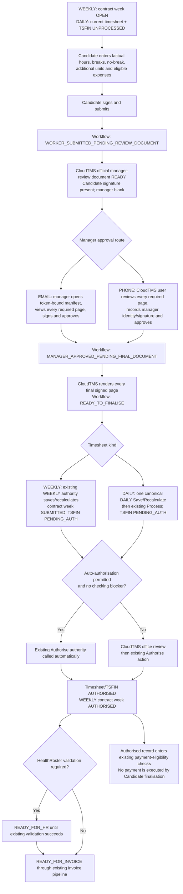
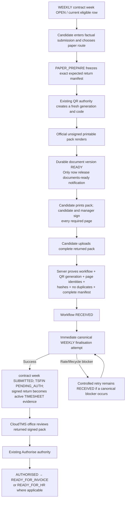
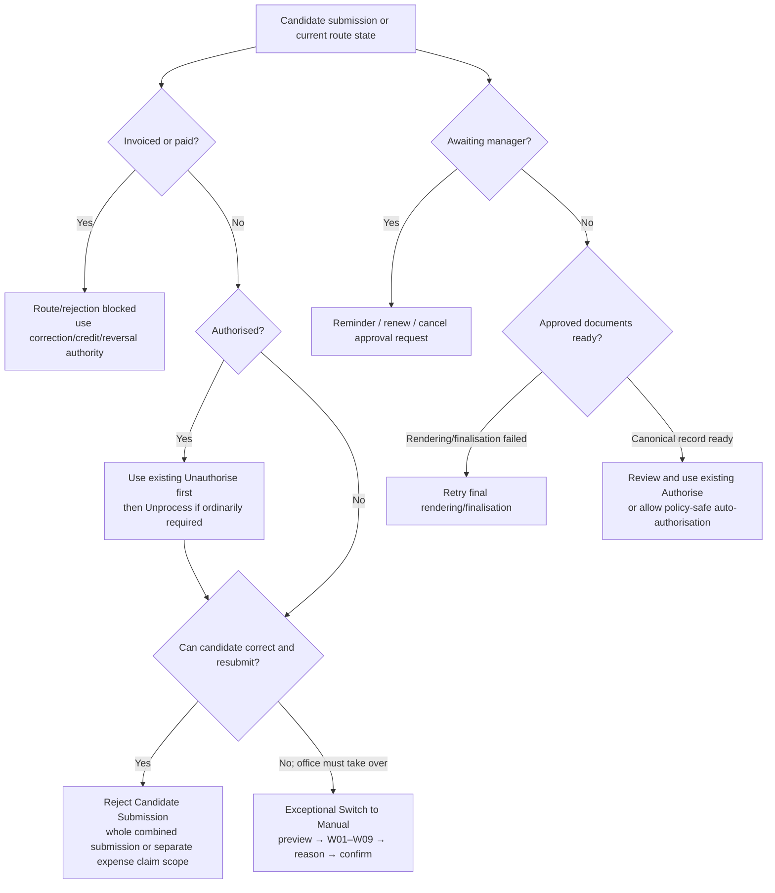

# CloudTMS Candidate App — Living Implementation Plan

Status: active implementation; TEST-only. Updated: 9 August 2026. Backend source implementation approximately 75% complete at this revision; publish, TEST deployment and runtime verification remain outstanding.

This is the controlling, evolving delivery plan. It deliberately keeps the completed DB/RPC authority, the current backend implementation, and the remaining CloudTMS frontend, private broker and Candidate App/web work in one sequence. It must be updated whenever implementation or independent audit changes the contract.

## Controlling architecture

- CloudTMS remains the sole owner of timesheet, financial and lifecycle truth.
- The Candidate App and private broker submit factual candidate inputs only.
- DAILY office, worker and Candidate entry points use the one canonical DAILY financial owner, followed by the existing Process and Authorise authorities.
- WEEKLY Candidate finalisation uses the existing WEEKLY calculation/lifecycle authority.
- Route conversion uses the one SQL route/version authority and server-owned preview/confirmation context.
- Candidate workflows may orchestrate evidence, approval and notifications, but may not calculate rates, pay, charge, VAT, ERNI, margin, invoice breakdown or TSFIN.
- The existing invoice Generator/Issuer, official timesheet renderer and Google DAILY rota/availability service remain authoritative and unchanged in economic meaning.
- Banking Pay, Policy X, payment, settlement and remittance are out of scope and must not change.

## Stage 1 — DB/RPC authority (installed in TEST; keep under regression)

The installed authority consists of exactly seven Candidate App tables and fourteen public service-role Candidate business RPCs, plus the approved amended existing/private functions. Latest-only SQL lives in `supabase/migrations` and `supabase/repeatable`; no duplicate qualified function definitions are permitted.

Completed authority includes:

- clean Candidate account/challenge/session state with refresh-family rotation and replay revocation;
- candidate-safe bootstrap, list, detail and missing-week projections;
- canonical route family and import-authoritative view-only enforcement;
- evidence category, economics-driven evidence requirements and immutable lineage;
- one-expense-claim-until-authorised concurrency control;
- manager-review generation, immutable component manifest, page review, approval and final document lineage;
- complete workflow/QR-bound paper return manifest;
- stale-safe DAILY save/recalculate composition through the one financial authority;
- server-owned issue and auto-authorisation blocker derivation;
- route preview/confirmation context, W01–W13 warning codes, intervention reasons, workflow/request retirement, fresh resubmission notification and QR state separation;
- exact feature-off legacy route/restore wrappers and ACL compatibility;
- W13 proof against the immutable manager-approved required-component manifest.

DB/RPC regression gates remain PostgreSQL 17.6/18.1 install/runtime suites, concurrency suites, ACL/feature-off parity, focused Candidate tests and full backend regression.

## Stage 2 — CloudTMS backend (current stage)

Implement and verify one versioned CloudTMS-owned HTTP boundary. The future broker must use it and must never query Supabase or R2 directly.

### Candidate authentication and session boundary

- enumeration-safe activation/reset/recovery challenge start and resend;
- single-use challenge verification;
- password establishment/reset plus first session creation through the transactional RPC;
- PBKDF2-HMAC-SHA256 verifier creation/verification in CloudTMS; no plaintext secret is sent to SQL;
- short-lived signed access tokens and opaque rotating refresh tokens, with only refresh hashes stored;
- login failure/lock handling, logout, candidate selection, password change, preferences and push-token registration;
- environment, session ID and rotation bound on every protected request.

### Candidate read/write boundary

- bootstrap, timesheet page/detail, missing-week options/create and notifications;
- workflow create/amend/cancel, factual submission and no-work;
- server-generated idempotency keys and stable safe error mapping;
- no raw database rows, financial authority fields or storage keys in responses.

Implemented HTTP groups at this revision:

- `/candidate-app/v1/auth/*` — challenge, activation/password completion, login, refresh-family rotation, logout and password change;
- `/candidate-app/v1/account/*` — selected candidate, preferences and encrypted push-token registration;
- `/candidate-app/v1/bootstrap`, `/timesheets`, `/timesheets/:id`, missing-week options/create and notifications;
- `/candidate-app/v1/timesheets/:id/expense-placement` and `/expense-carrier` — Candidate-authenticated adapters over the installed placement/carrier authorities;
- `/candidate-app/v1/workflows/*` — create, components, factual submission, approval-route selection, reminder/renewal, paper return, finalise and cancel/supersede;
- `/candidate-manager/v1/*` — token-bound manifest, component stream, review progress, signature upload, approve and refuse;
- `/api/candidate-app/*` — office route preview/confirm, phone-review actions, whole-record rejection and finalisation retry.

### Component and document boundary

- opaque, scoped upload tickets;
- backend R2 writes with strict media/size limits and server SHA-256 verification;
- component PREPARE/COMPLETE using server-authoritative storage identity and digest;
- opaque download tickets and backend streaming; broker/app never receive an R2 key;
- explicit no-break input (`break_minutes = 0`, no start/end) accepted for WEEKLY and DAILY; DAILY creates the existing non-60-minute checking issue while WEEKLY does not.

### Manager review and finalisation

- after worker submission, render and register every required review page before an approval request can be created;
- extend the one official timesheet renderer with `ELECTRONIC_MANAGER_REVIEW` and keep the candidate signature visible while the manager signature/date remain blank;
- render expense summary/evidence pages from the frozen server contract and immutable source bytes;
- email and phone review use one workflow/request/manifest authority;
- public manager endpoints use only a hashed approval token at the SQL boundary;
- require every required component to be viewed before approve;
- upload and bind one manager signature to the exact approval request;
- after approval, render/register every final signed derivative, then call the existing finalisation authority;
- DAILY finalisation delegates to the canonical DAILY materialisation seam; WEEKLY uses the existing WEEKLY authority;
- manager refusal, reminder, renewal and cancellation retain deterministic outbox identities.

#### Simultaneous manager approvals and recovery

The backend and installed SQL are designed for many independent manager approvals at once. Fifty managers approving fifty different shifts do not acquire one global application lock. Each request locks only its own approval request, workflow generation, required manifest and target timesheet/financial rows. The approval transaction commits before document rendering and canonical finalisation are attempted.

The required operational guarantees are:

- one shift cannot roll back or block the other 49;
- request/workflow idempotency prevents a double-click or HTTP retry from recording two approvals;
- manifest hashes, request generation, row signature and workflow generation reject stale approvals;
- Cloudflare request concurrency handles separate approvals independently while PostgreSQL serialises only genuinely conflicting work on the same shift;
- final PDF rendering and finalisation run as guarded `waitUntil` follow-on tasks, so the public approval response does not remain open while R2/PDF work completes;
- a follow-on failure is contained and logged by stable error code; manager approval remains durable and no partial canonical finalisation is accepted;
- the office `retry-finalisation` action regenerates/registers any outstanding final document and retries the idempotent canonical finalisation without asking the manager to sign again;
- the database remains the authoritative retry ledger through workflow, component render and finalisation states.

The focused backend suite includes a 50-task isolation fixture with 49 successes and one injected render failure. DB two-session suites remain the authority for same-workflow races; load/soak verification against TEST is a post-deployment non-mutating or separately authorised fixture gate.

### Office route and workflow boundary

- add office route-change preview/confirm handlers over the installed SQL context hash and row signature;
- require the closed intervention reason catalogue where directed by SQL;
- remove normal-product use of revoked QR restore when the new route feature is enabled;
- do not run broad route-triggered physical evidence purge; preserve signed/issued history;
- expose office phone-review, reminder, rejection and affected-row refresh adapters required by the existing CloudTMS UI.

### Push and mail orchestration

- Candidate notifications remain database lifecycle truth;
- push delivery workers claim and update Candidate notification rows idempotently, respecting preferences;
- QR “documents ready” push is released only by durable pack readiness;
- manager and candidate transactional email uses deterministic `mail_outbox` rows and the existing outbox delivery system; this stage does not drain mail.

QR/paper document generation is delegated to `timesheet_qr_send_enqueue_v1` and the existing durable document-operation worker. Candidate `PAPER_PREPARE` records the complete immutable return manifest first, then queues the exact current timesheet through that authority. The pack-ready database trigger—not the initial route action—releases the “documents are ready” notification.

The same enqueue operation creates the candidate email automatically and holds it until the official PDF is `READY`; the candidate does not request a second email. When ready, the existing mail authority attaches and releases the pack. The app uses the Candidate notification feed (and later provider push when enabled) to refresh the timesheet, then downloads the pack through `GET /candidate-app/v1/timesheets/:timesheetId/paper-pack`. CloudTMS checks ownership and durable readiness and streams the bytes; no Supabase query or R2 key is exposed to the broker/app. Queued, rendering, ready, sent and failed remain distinct states.

The future broker/app must handle the asynchronous response explicitly: a `202` PAPER_PREPARE response shows **Preparing documents**, refreshes the Candidate notification feed and `GET /candidate-app/v1/timesheets/:timesheetId/paper-pack/status` with bounded backoff while that screen remains active, refreshes again when the app resumes or receives the readiness push, and enables **Download documents** only after server readiness. The app never polls Supabase/R2 and never manufactures a ready state from the presence of a QR token.

Manager EMAIL requests have the same fail-closed readiness rule. Every required review component—including the candidate-signed hours page, expense summary, mileage form and each evidence page—must be rendered, stored, hashed and present in the immutable all-ready manifest before the manager request or email can be created. A manager opening the link views already-generated documents. The final manager-signed derivatives remain a separate asynchronous post-approval step.

### End-to-end lifecycle and CloudTMS intervention map

The following flows are controlling for backend, frontend, broker and app work. A `contract_weeks` row is the WEEKLY planning/lifecycle owner; it is not itself a processed timesheet. DAILY starts from an existing current DAILY timesheet and current TSFIN row in the ordinary unprocessed lifecycle. Candidate PAPER/QR applies to WEEKLY only.

#### ELECTRONIC — WEEKLY and DAILY

CloudTMS can intervene on the electronic path as follows:

- before CloudTMS authorisation, use **Reject Candidate Submission** where the candidate should correct and resubmit; a combined workflow is rejected as one complete hours-and-expense submission, while a separate expense carrier rejects only that separate claim;
- send a manager reminder, renew or cancel/supersede a live email approval request using the single workflow/request authority;
- retry final-document rendering or canonical finalisation after a contained follow-on failure without asking the manager to sign again;
- exceptionally convert ELECTRONIC to MANUAL using server preview, W01/W02/W03/W07 as applicable, a mandatory intervention reason, context hash and confirmed atomic transition; this cancels/supersedes any live manager request and preserves signed history;
- once CloudTMS-authorised, rejection or route conversion is blocked until the existing **Unauthorise** process has completed; Unprocess afterwards where the existing lifecycle requires it;
- invoiced or paid records cannot be rejected or route-converted; use the established additional-timesheet, correction, credit or reversal route;
- MANUAL to ELECTRONIC always creates a fresh unsigned logical ELECTRONIC generation, requires new candidate/manager submission, does not reuse old signatures, and creates one idempotent worker notification.

#### QR/PAPER — WEEKLY only

PAPER never auto-authorises. CloudTMS must review and use the existing Authorise action. CloudTMS interventions are:

- before return, reissue the QR pack through the one route/version authority; the old code and pack are invalidated, the old workflow is retired, historical issued artefacts are retained, and notification waits for replacement-pack readiness;
- convert an issued unsigned pack to MANUAL using W08, or a signed returned pack using W09, with the required intervention reason and confirmed route context;
- reject the complete Candidate submission before authorisation; after authorisation, Unauthorise first;
- where a return is incomplete, duplicated, foreign or bound to the wrong workflow/generation/code, fail closed and leave it unprocessed;
- never restore a revoked historical QR generation as the normal correction route; **Allow QR again** creates a fresh generation/code/pack subject to prior QR lineage or current paper permission;
- never physically purge candidate-signed, manager-approved, issued QR, returned signed QR or final signed evidence as a route-change side effect.

#### CloudTMS office decision points

These office actions never create a second financial, Process, Authorise, QR/version, invoice or approval engine. They compose the installed canonical authorities and preserve immutable audit evidence.

## Stage 3 — CloudTMS frontend (after backend independent GO)

- consume server route/capability/status projections; never infer route or economics in the browser;
- implement Simple Timesheet, Timesheet Summary, Bulk Process and Bulk Authorise Candidate states/actions using existing UI patterns;
- use one shared route-warning renderer containing the approved W01–W13 wording;
- use preview → warning/reason → confirmed transition; never mutate on first click;
- hide ordinary revoked-QR restore and ordinary exact electronic restore; use fresh resubmission actions;
- retain the approved manager reminder, Candidate rejection, evidence eligibility, border, tooltip and Expense Email missing-badge decisions;
- merge into the then-current frontend worktree and prove patched assets loaded before browser assertions.

The exact W01–W13 warning catalogue in `docs/candidate-app/ROUTE_WARNING_CATALOGUE.md` remains controlling and must be consumed unchanged by the frontend shared warning module.

## Stage 4 — private broker (after backend/frontend contract GO)

- CloudTMS HTTP API only; no Supabase or R2 credentials, SDKs or direct queries;
- opaque candidate access/refresh tokens and document/upload tickets only;
- no financial calculations, route inference, approval truth or official PDF recreation;
- versioned request/response validation, stable CloudTMS error mapping, retries only for idempotent operations, rate limiting and audit correlation;
- mediate the unchanged Google DAILY rota/availability integration without moving official DAILY lifecycle authority out of CloudTMS.

## Stage 5 — Candidate App and responsive web client

- factual hours, starts/finishes, explicit no-break or break interval/minutes, additional units and expense inputs only;
- exact-category evidence choice may be omitted by the candidate only where the UI context is unambiguous; the backend/RPC immutable component always records one exact server-derived category;
- display server statuses/capabilities, manager documents, notifications and rejection reasons;
- render CloudTMS-generated official documents rather than reconstructing them;
- provide PHONE/EMAIL manager review for DAILY and policy-eligible ELECTRONIC/QR routes for WEEKLY;
- secure local token storage, accessibility, offline-safe drafts and idempotent resume without creating local lifecycle truth.

## Completion gates

Backend completion requires source review, focused unit/contract tests, full backend regression, Wrangler dry run, read-only TEST catalogue/smoke verification, exact commit push, normal TEST deploy of that commit, and harmless runtime health/version proof. No Candidate workflow, email, notification, R2 or financial mutation is required for deployment verification.

Overall Candidate delivery is complete only after DB/RPC, backend, frontend, broker and app/web stages each pass independent verification and the coordinated TEST feature enablement is explicitly approved.
