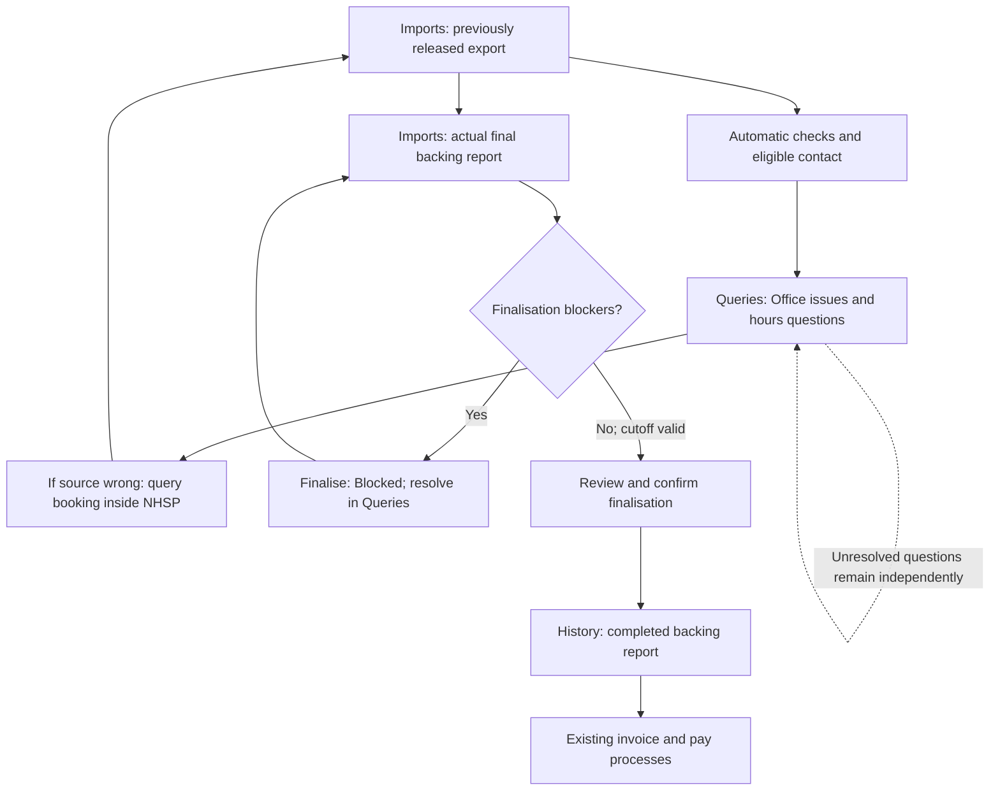
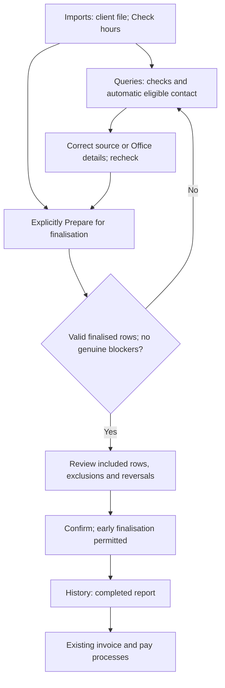
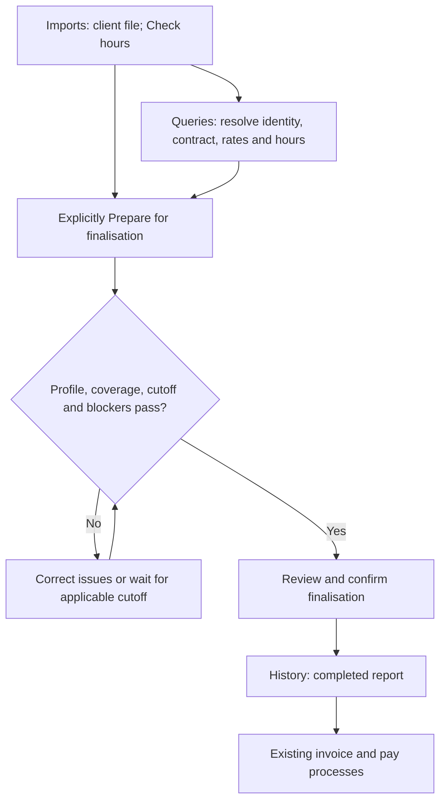
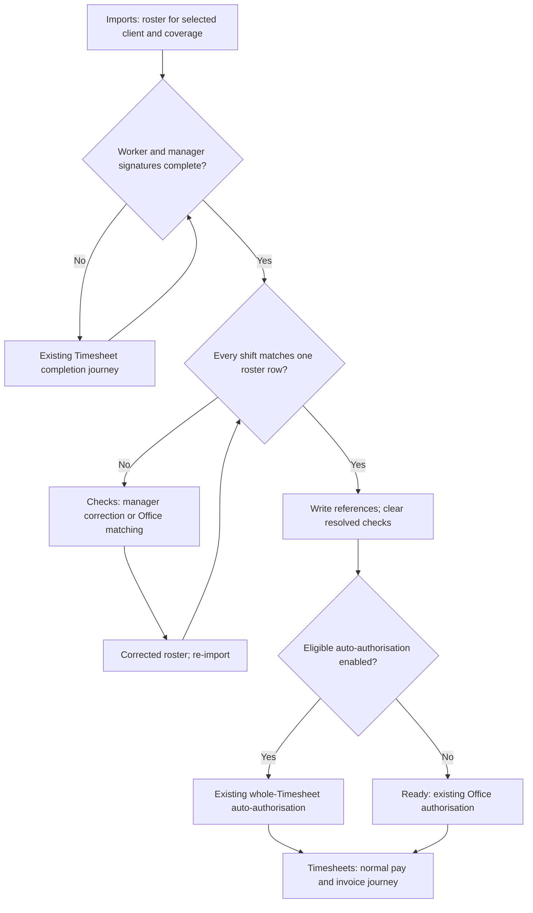

# Policy-derived journey flows

Read with README rules R01–R12 and the matching numbered screens in journeys.policy.json. These are proposed presentation flows over retained business authority, not evidence of runtime acceptance.

## NHSP — R02/R03/R04/R07/R08/R09

## Import-authoritative HealthRoster — R02/R03/R04/R07/R09

Recognised non-finalised rows require explicit exclusion acknowledgement in a mixed report; invalid rows claiming finalisation cannot be bypassed. Unanswered hours questions alone are not genuine finalisation blockers. Protected pay remains separate from invoicing.

## Configured Magnit import-authoritative profile — R01/R02/R03/R07/R09/R12

A brand name is not a source profile or early-finalisation grant. The depicted summary profile uses supplied total hours and booking evidence; no break interval is invented. Checking remains selectable after cutoff.

## Signed-Timesheet-authoritative Weekly roster — R01/R06/R10/R11

No source finalisation or finalised-report History entry is created. Reference-required-before-pay, if enabled, remains an independent pay gate. Source mismatches never grant an Accept system hours action on this route. Ordinary Weekly without import and Daily retain existing journeys.
